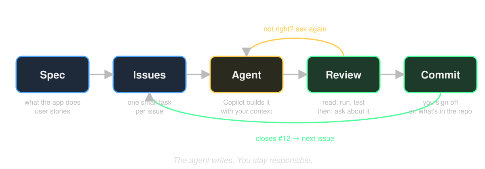

# The final assignment
## Your own app, your way of working

---

# In one sentence

> Build a mobile app on **live data** from PokeAPI, with Copilot, and show us **how** you worked.

The product is 40% of your grade. How you worked with the agent is 60%.

---

# Three routes

| | Pokédex | Battle simulator | Your own idea |
|---|---|---|---|
| **What** | The course app, finished and extended | Two Pokémon fight by the real rules | Anything with one clear core action |
| **Design** | Figma, strict | Your own | Your own: a sketch per screen |
| **Specs** | Fixed list (appendix A) | Fixed list (appendix B) | You write them: 3–6 user stories |
| **API** | PokeAPI | PokeAPI | PokeAPI or any public API without login or key |
| **Approval** | Tell me in Teams | Tell me in Teams | Idea note (template on day 2), feedback in the holiday, final go on day 3 |

Think about your choice **before day 2**.

---

# Technical core (every route)

- Runs in **Expo Go** via QR code
- Live data from a public API with **TanStack Query**
- At least **2 screens** with **Expo Router**
- Something saved in **SQLite** that survives a restart
- Every load has a **loading** and an **error** state
- At least **1 native feature** (Share, haptics, camera, ...)
- **TypeScript** and **ESLint** without errors
- **Logical structure**: UI, data and logic are not mixed

You learn all of this on days 1 and 2.

---

---

# How you will work

1. **Spec**: write what the app does, as user stories.
2. **Issues**: one small task per GitHub issue.
3. **Agent**: Copilot builds one issue, with your spec as context.
4. **Review**: you read it, run it, test it. Then you *ask about it* until you understand it.
5. **Commit**: `closes #12`. Next issue.

Today you see this once. Day 3 you do it for real.

---

# What you hand in

One GitHub repo with:

- The **app**
- `specs/product.md`: what the app does, 3–6 user stories
- `.github/copilot-instructions.md`: what you told the agent about your project
- **GitHub Issues**, closed by commits
- `chat-history/`: a copy of your Copilot chats (we give you a script)
- `docs/toelichting.md`: 1 page, 4 questions
- A **demo video**, max 3 minutes, app on your phone, you talking

Link in Teams before the deadline.

---

# Your grade

**5.5** when the technical core is complete, everything is handed in, and the app does what your spec says.

Above that:

| Part | Weight | We look at |
|---|---|---|
| Product | 40% | Works, complete, code quality |
| Directing | 20% | Small tasks, context, your own choices |
| Checking | 20% | You read, tested and corrected the agent's work |
| Understanding | 20% | Your explanation and video match the code |

Bonus, +1 each: animations, dark mode, infinite scroll, clean TypeScript, pixel-perfect or consistent design, custom font, localisation, zero bugs.

---

# Three skills we grade

**Directing.** One task at a time. Give context: spec, files, instructions. You decide, the agent executes.

**Checking.** Read everything the agent makes. Test it. Wrong? Step in.

**Understanding.** Working with an agent is fast. Losing the overview is faster. After every agent task: **ask about it** until you can explain it in your own words.

---

# Your Copilot chats are part of the grade

- VS Code saves every chat on your disk. You hand in a copy.
- We read them next to your commits and your explanation.
- They are **evidence**, not a grade on their own.
- One prompt "build the whole app" followed by "fix it" ×20: we see that.

---

# How to think about AI

**"AI is just another abstraction."** (Levi)
Assembly → C → JavaScript → React Native → an agent that writes it. Every layer hides work. The layer below is still there, and still your problem when it breaks.

**"A lot of knowledge, a bit less intelligence."** (Kevin)
The model has read more than anyone. But knowledge is not intelligence. It knows everything and just misses *your* situation. That is why it writes a flawless API call and then guesses wrong about what you wanted.

So: give context, check the output, understand what you ship.

---

# The agent writes.
# You stay responsible.

Everything in your repo, you can explain and defend.

---

# Before day 2

- Think about your route: Pokédex, battle simulator, or your own idea.
- Own idea? On day 2 you get the template for the idea note.
- Read the full assignment in `day-3/README.md`.
