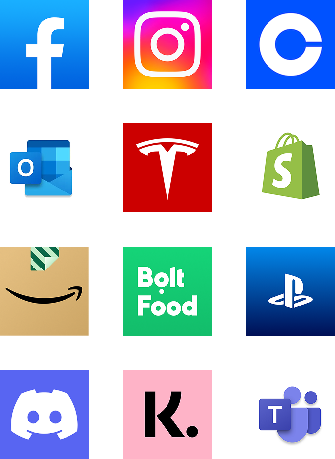
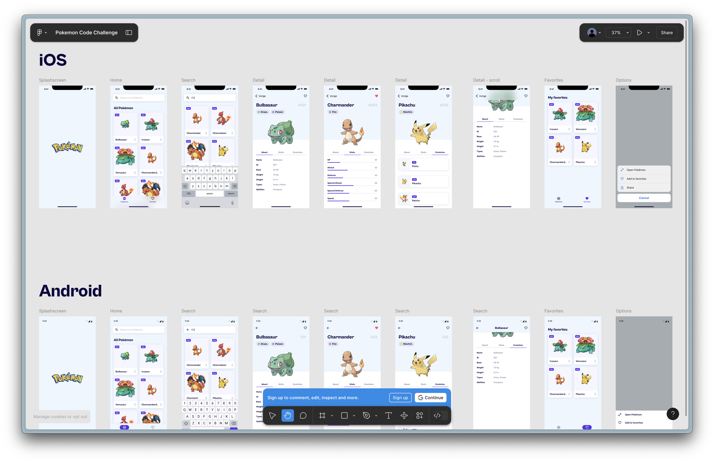
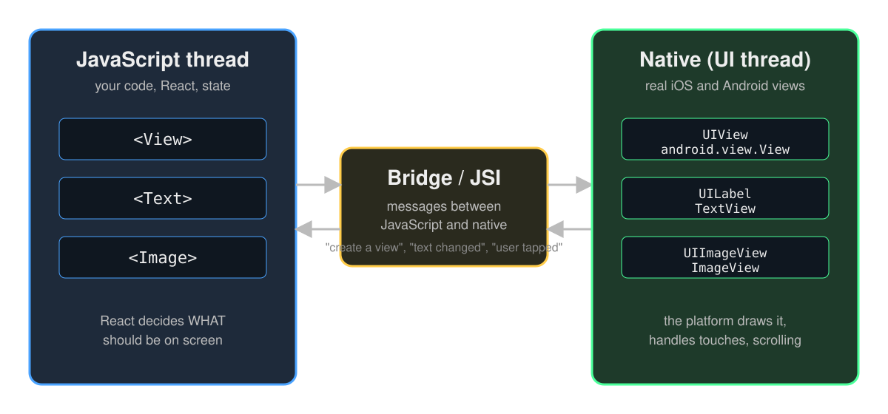
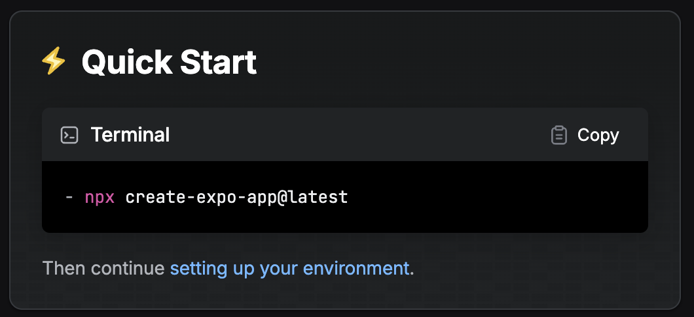
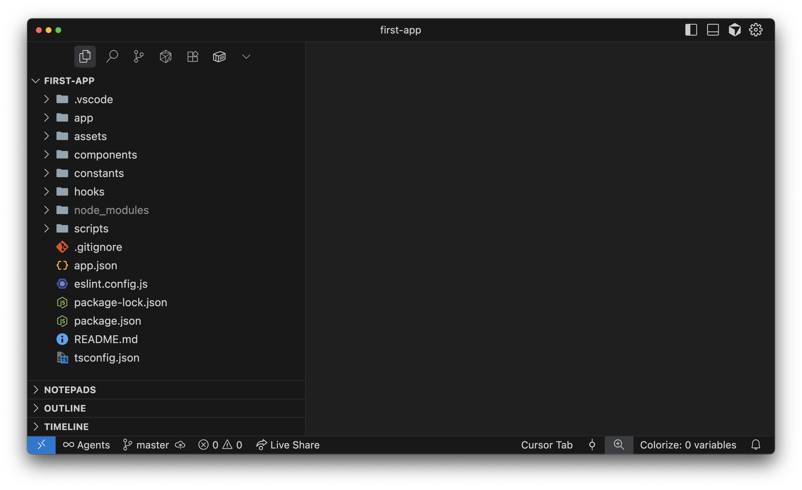
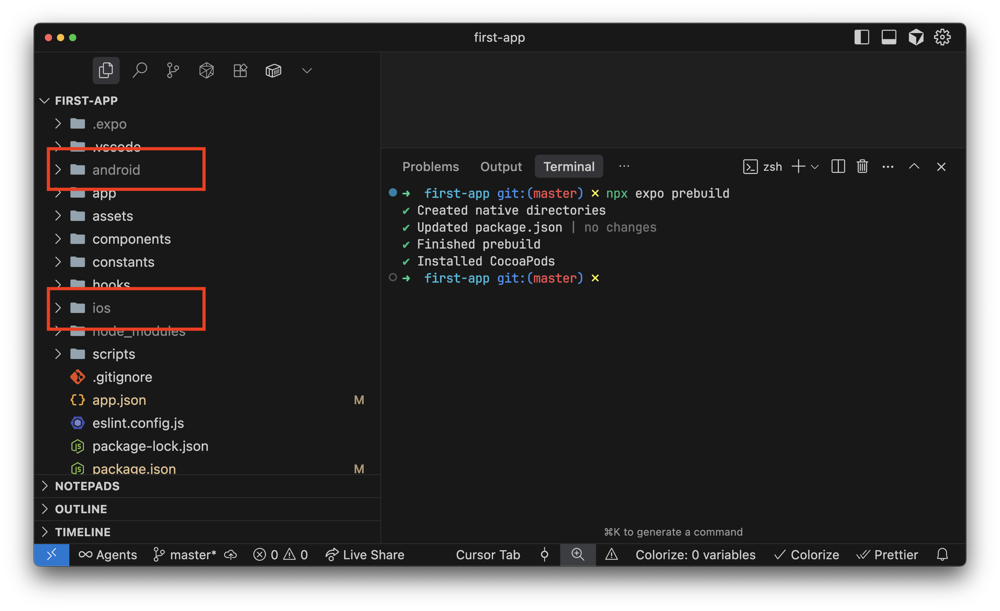
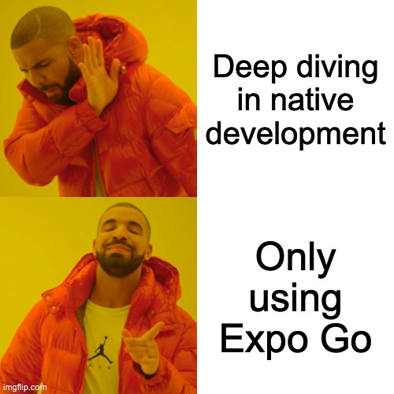
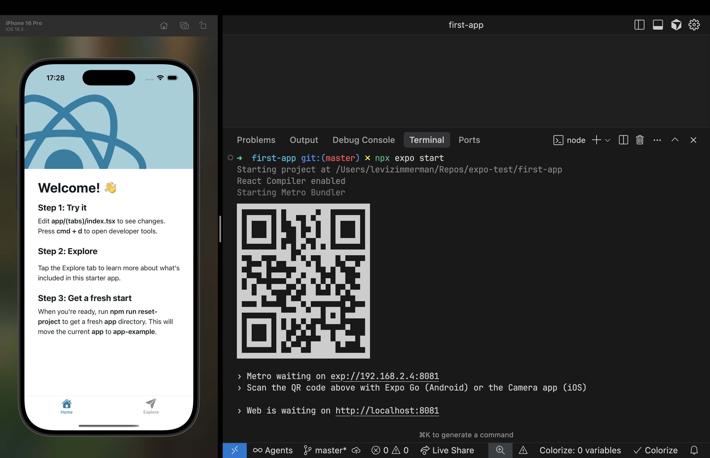

# React Native
## Mobile Development Minor



---

# About me


<!-- Kevin: replace these three lines and add ../assets/kevin.png -->

- Mobile developer at Hypersolid (Alkmaar)
- iOS, Android and React Native
- Took over this course from Levi in 2026

---

# Meet the React Native team

<style>
.profile {
   width: 100px;
   height: 100px;
   background-size: cover;
   background-position: center;
   background-repeat: no-repeat;
   border-radius: 50%;
   border: 2px solid #fff;
   display: inline-block;
}
</style>

<table style="width:100%; table-layout:fixed; border:none;">
  <tr style="border:none;">
    <td style="border:none; text-align:center;"><div class="profile" style="background-image: url('../assets/kevin.png');"></div></td>
    <td style="border:none; text-align:center;"><div class="profile" style="background-image: url('../assets/levi.png');"></div></td>
    <td style="border:none; text-align:center;"><div class="profile" style="background-image: url('../assets/max.png');"></div></td>
    <td style="border:none; text-align:center;"><div class="profile" style="background-image: url('../assets/thomas.png');"></div></td>
    <td style="border:none; text-align:center;"><div class="profile" style="background-image: url('../assets/silvan.png');"></div></td>
    <td style="border:none; text-align:center;"><div class="profile" style="background-image: url('../assets/danique.png');"></div></td>
    <td style="border:none; text-align:center;"><div class="profile" style="background-image: url('../assets/leon.png');"></div></td>
    <td style="border:none; text-align:center;"><div class="profile" style="background-image: url('../assets/damisa.png');"></div></td>
  </tr>
  <tr style="border:none;">
    <td style="border:none; text-align:center;">Kevin</td>
    <td style="border:none; text-align:center;">Levi</td>
    <td style="border:none; text-align:center;">Max</td>
    <td style="border:none; text-align:center;">Thomas</td>
    <td style="border:none; text-align:center;">Silvan</td>
    <td style="border:none; text-align:center;">Danique</td>
    <td style="border:none; text-align:center;">Leon</td>
    <td style="border:none; text-align:center;">Damisa</td>
  </tr>
  <tr style="border:none;">
    <td style="border:none; text-align:center; font-size:1rem; color:#888;">Mobile Dev</td>
    <td style="border:none; text-align:center; font-size:1rem; color:#888;">Team lead</td>
    <td style="border:none; text-align:center; font-size:1rem; color:#888;">Web/RN Dev</td>
    <td style="border:none; text-align:center; font-size:1rem; color:#888;">Web/RN Dev</td>
    <td style="border:none; text-align:center; font-size:1rem; color:#888;">Web/RN Dev</td>
    <td style="border:none; text-align:center; font-size:1rem; color:#888;">Web/RN Dev</td>
    <td style="border:none; text-align:center; font-size:1rem; color:#888;">Tech lead</td>
    <td style="border:none; text-align:center; font-size:1rem; color:#888;">Intern</td>
  </tr>
</table>

---

# Our React Native projects

<style>
.projects-flex { display: flex; justify-content: space-between; gap: 1.5rem; width: 100%; margin-bottom: 1.5rem; }
.project-item { flex: 1 1 0; display: flex; flex-direction: column; align-items: center; min-width: 0; }
.project-item video { width: 100%; max-width: 220px; border-radius: 8px; background: #000; display: block; }
.project-caption { margin-top: 0.5rem; text-align: center; font-size: 1rem; font-weight: 500; }
</style>

<div class="projects-flex">
  <div class="project-item"><video src="../assets/demo-fleurametz.mp4" autoplay loop muted controls></video><div class="project-caption">Fleurametz</div></div>
  <div class="project-item"><video src="../assets/demo-knvb.mp4" autoplay loop muted controls></video><div class="project-caption">KNVB</div></div>
  <div class="project-item"><video src="../assets/demo-mind-oasis.mp4" autoplay loop muted controls></video><div class="project-caption">Rituals</div></div>
  <div class="project-item"><video src="../assets/demo-new-black.mp4" autoplay loop muted controls></video><div class="project-caption">New Black</div></div>
  <div class="project-item"><video src="../assets/demo-vfz.mp4" autoplay loop muted controls></video><div class="project-caption">VodafoneZiggo</div></div>
</div>

---

# How this course works

- **4 days.** Each day: short slides, then you build.
- **One app.** We build a Pokédex together, day 0 to day 3.
- **Copilot from day 0.** Today it explains code. Later it writes code, on your instructions.
- **Final assignment.** Your own app on live data. Your *process* counts as much as your product.

> **The agent writes. You stay responsible.**

---

# Course overview

<style>
.col-4 { display: grid; grid-template-columns: 1fr 1fr 1fr 1fr; gap: 1rem; }
.col-4 h4 { margin-bottom: 0.3rem; }
.col-4 em { color: #ffcc4a; font-style: normal; }
</style>

<div class="col-4">
<section>

#### Day 0 👈
- What is React Native
- Under the hood
- Web vs Native
- Setup + first run
- *Copilot: explain*

</section>
<section>

#### Day 1
- Components
- Styling + theming
- Navigation
- ESLint
- *Copilot: autocomplete, chat*

</section>
<section>

#### Day 2
- State
- TanStack Query
- SQLite
- Debugging
- *Copilot: agent mode*

</section>
<section>

#### Day 3
- Project structure
- Spec → issues → agent
- Start your own app
- Use of AI
- *Copilot: the full loop*

</section>
</div>

---

# The final assignment



Your own app on live data from PokeAPI.

- Pokédex, battle simulator, or your own idea
- Built with Copilot, **your way**
- We grade the product **and** how you worked

More at the end of today.

---

# What is React Native?

- **Cross-platform mobile framework** by Meta
- **One codebase** for iOS and Android
- **JavaScript / TypeScript** and React
- **Real native UI**, not a web page in a wrapper
- **Large community** and ecosystem

---


---

# Why React Native?

- **Cheaper**: one team, one codebase
- **Easier hiring**: JavaScript developers are everywhere
- **Consistent**: same features on both platforms at the same time

---

# Why not React Native? 🔥

- **Less control** over the native side
- **Dependent** on the community for native modules
- **Abstracts** the native side away. It is still there when things break.

---

# Under the hood

Your React code does **not** draw pixels.

1. Your JavaScript runs in its own thread.
2. React decides *what* should be on screen: a `<View>`, a `<Text>`.
3. That decision is sent to the native side.
4. iOS or Android creates a **real native view** and draws it.

---



---

# Under the hood

```tsx
<View style={{ padding: 16 }}>
  <Text>Hello</Text>
</View>
```

| What you write | iOS | Android |
|---|---|---|
| `<View>` | `UIView` | `android.view.View` |
| `<Text>` | `UILabel` | `TextView` |
| `<Image>` | `UIImageView` | `ImageView` |
| `<ScrollView>` | `UIScrollView` | `ScrollView` |

Native scrolling, native text rendering, native touch handling. Every day we will point at this picture: *what happens natively here?*

---

# What do you need

### Required
- **Node.js** (LTS)
- **Expo**
- **Expo Go** on your phone

### Optional
- **Xcode** (iOS simulator, Mac only)
- **Android Studio** (Android emulator)



---

# What is Expo?

> _Expo is a framework and a platform for building React Native applications._

<table align="center" style="border: none;">
  <tr>
    <td align="center" style="border: none;">🚀<br/>CNG</td>
    <td align="center" style="border: none;">📱<br/>Expo Go</td>
    <td align="center" style="border: none;">🔄<br/>OTA</td>
  </tr>
  <tr>
    <td align="center" style="border: none;">🛠️<br/>Native APIs</td>
    <td align="center" style="border: none;">🌐<br/>X Platform</td>
    <td align="center" style="border: none;">⚡<br/>EAS</td>
  </tr>
  <tr>
    <td align="center" style="border: none;">📤<br/>Submission tools</td>
    <td align="center" style="border: none;">🗂️<br/>Asset management</td>
    <td align="center" style="border: none;">📚<br/>Docs & Support</td>
  </tr>
</table>

---

# What YOU 🫵🏻 will use

<table align="center" style="border: none;">
  <tr>
    <td align="center" style="border: none; opacity: 0.4;">🚀<br/>CNG</td>
    <td align="center" style="border: none;">📱<br/>Expo Go</td>
    <td align="center" style="border: none; opacity: 0.4;">🔄<br/>OTA</td>
  </tr>
  <tr>
    <td align="center" style="border: none;">🛠️<br/>Native APIs</td>
    <td align="center" style="border: none; opacity: 0.4;">🌐<br/>X Platform</td>
    <td align="center" style="border: none; opacity: 0.4;">⚡<br/>EAS</td>
  </tr>
  <tr>
    <td align="center" style="border: none; opacity: 0.4;">📤<br/>Submission tools</td>
    <td align="center" style="border: none; opacity: 0.4;">🗂️<br/>Asset management</td>
    <td align="center" style="border: none;">📚<br/>Docs & Support</td>
  </tr>
</table>

---

# CNG: Continuous Native Generation



---

# CNG: Continuous Native Generation



The `ios/` and `android/` folders are **generated** from your config. You do not edit them. You need this for widgets, build variants or custom native code. Not in this course.

---

# Keep it simple



---

# Expo Go



---

# Break

## In 10 minutes: setup. Bring your phone.
