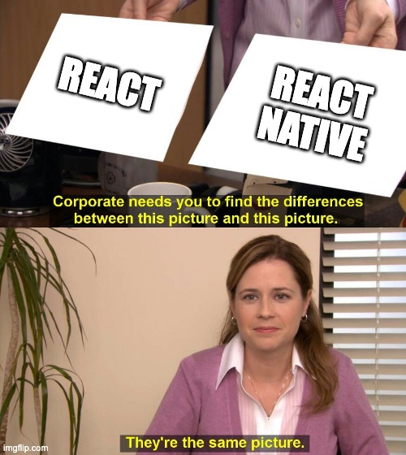
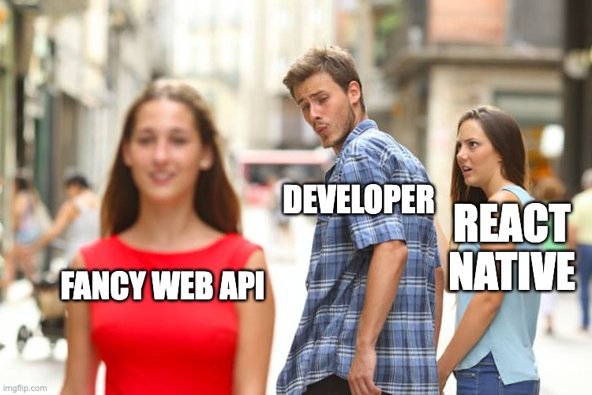

# React vs React Native
## What is the same, what is different


---

# What is the same



- JSX
- Hooks
- Components and props
- File-based routing
- Component-scoped styles

---

## JSX
```jsx
// Same syntax in both
const Welcome = ({ name }) => {
  return <Text>Hello, {name}!</Text>
}

// Conditional rendering
{isLoggedIn ? <Dashboard /> : <Login />}

// Lists
{users.map(user => <UserCard key={user.id} user={user} />)}
```

---

## Hooks
```jsx
// useState: same
const [count, setCount] = useState(0)

// useEffect: same
useEffect(() => {
  fetchData()
}, [dependency])

// Custom hooks: same
const { data, isLoading } = usePokemon('pikachu')
```

---

## File-based routing: Next.js
```
app/
├── page.js           // → /
├── about/
│   └── page.js       // → /about
└── blog/
    ├── page.js       // → /blog
    └── [slug]/
        └── page.js   // → /blog/:slug
```

---

## File-based routing: Expo Router
```
app/
├── _layout.tsx       // root layout
├── index.tsx         // → /
├── about.tsx         // → /about
└── pokemon/
    └── [name].tsx    // → /pokemon/pikachu
```

Same idea. This is what the default Expo template gives you.

---

# What is different



- No DOM, no browser
- Native components instead of HTML
- Touch instead of mouse
- A subset of CSS, no units
- Navigation is a native stack

---

## Runtime: web
```jsx
// The browser is there
document.getElementById('root')
window.location.href
localStorage.setItem('key', 'value')
navigator.userAgent
```

---

## Runtime: React Native
```jsx
// No window, no document, no localStorage
import { Linking } from 'react-native'
import * as SQLite from 'expo-sqlite'

// Everything that touches the phone goes through a native module
Linking.openURL('https://pokeapi.co')
```

Under the hood: your JavaScript asks the native side to do it.

---

## Elements: web
```jsx
<div className="container">
  <h1>Title</h1>
  <p>Paragraph</p>
  <button onClick={handleClick}>Click me</button>
  <input type="text" value={value} onChange={onChange} />
  
  <a href="/link">Link</a>
</div>
```

---

## Elements: React Native
```jsx
<View style={styles.container}>
  <Text style={styles.title}>Title</Text>
  <Text>Paragraph</Text>
  <Pressable onPress={handlePress}>
    <Text>Press me</Text>
  </Pressable>
  <TextInput value={value} onChangeText={onChangeText} />
  <Image source={{ uri: 'https://...' }} />
  <Link href="/about">Link</Link>
</View>
```

Every one of these becomes a **real native view**. Text only goes inside `<Text>`.

---

## Navigation: web
```jsx
import { BrowserRouter, Routes, Route } from 'react-router-dom'

<BrowserRouter>
  <Routes>
    <Route path="/" element={<Home />} />
    <Route path="/pokemon/:name" element={<Pokemon />} />
  </Routes>
</BrowserRouter>

navigate('/pokemon/pikachu')
```

The URL changes. The page swaps.

---

## Navigation: Expo Router
```tsx
import { Link, router } from 'expo-router'

<Link href="/pokemon/pikachu">Pikachu</Link>

router.push('/pokemon/pikachu')
```

A **native stack**: the new screen slides in, swipe back works, the OS animates it. Day 1.

---

## Interaction: web
```jsx
<div
  onClick={handleClick}
  onMouseOver={handleHover}
  onKeyDown={handleKeyPress}
>
  Interactive element
</div>
```

Mouse, keyboard, hover, focus.

---

## Interaction: React Native
```jsx
<Pressable onPress={handlePress} onLongPress={handleLongPress}>
  <Text>Press me</Text>
</Pressable>
```

Touch, long press, swipe, pinch. No hover. Haptics instead.

---

## Styling: web
```css
.container {
  display: flex;
  flex-direction: row;
  margin: 10px;
  border: 1px solid #ccc;
  box-shadow: 0 2px 4px rgba(0,0,0,0.1);
  background: linear-gradient(45deg, #f0f0f0, #fff);
}
```

Full CSS. Cascading. Classes.

---

## Styling: React Native
```jsx
const styles = StyleSheet.create({
  container: {
    flexDirection: 'row',   // flex is the default layout
    margin: 10,             // no units
    borderWidth: 1,         // different property names
    borderColor: '#ccc',
    // no boxShadow (use elevation / shadow*), no gradients, no cascade
  },
})
```

A subset of CSS as JavaScript objects. Flexbox everywhere. Day 1.

---

# Summary

| Same | Different |
|---|---|
| ✅ JSX | 🔄 No DOM, native runtime |
| ✅ Hooks | 🔄 Native components |
| ✅ Components | 🔄 Touch, not mouse |
| ✅ File-based routing | 🔄 Native stack navigation |
| ✅ Scoped styles | 🔄 CSS subset, no units |

---

# Next: exercise 2

Ask Copilot to explain the project you just created.

Then, at the end of today: the final assignment.
