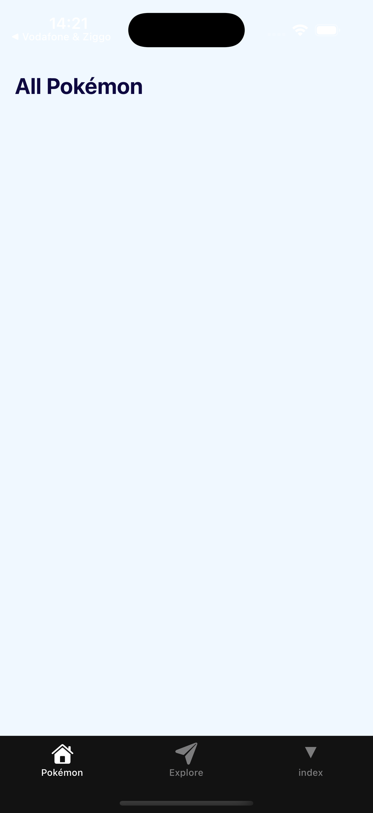

# Exercise 2: Styling and theming

### Objective
Build the Pokémon screen and give the app its look, with every colour defined once in a theme file.

**By hand. No Copilot Chat in this exercise.** Autocomplete is fine.

> Figma: [Pokemon Code Challenge](https://www.figma.com/design/dsgGXcu5WELIvRW90m5308/Pokemon-Code-Challenge)



### Requirements

1. The first tab is called **Pokémons** and shows the title "All Pokémon" on the Figma background colour.
2. All colours, spacing and radii live in `constants/theme.ts`. **No hex code anywhere else.**
3. Content respects the safe area (notch, status bar).

### Steps to Complete

1. **Clean up the template.** Delete `app/(tabs)/explore.tsx` and its `<Tabs.Screen>` entry in `app/(tabs)/_layout.tsx`. Rename the `index` tab to `Pokémons`. Run the app: one tab left.

   > **📚 Reference:** [Expo Router Tabs](https://docs.expo.dev/router/advanced/tabs/)

2. **Read the Figma file.** Write down the colours you see: background, card, badge, badge text, title text. Pick the values from the design, do not guess.

3. **Extend the theme.** Open `constants/theme.ts`. The template already has `Colors.light` and `Colors.dark`. Add your keys to **both** (use the same values in `dark` for now; dark mode is a bonus later). Then add spacing and radius tokens:

   ```ts
   export const Spacing = { xs: 4, s: 8, m: 16, l: 24 } as const
   export const Radius = { s: 8, m: 12, l: 16 } as const
   ```

   Name tokens after their **purpose** (`card`, `badge`), not their colour (`purple`).

   > **📚 Reference:** [Naming tokens in design systems](https://medium.com/eightshapes-llc/naming-tokens-in-design-systems-9e86c7444676)

4. **Build the screen.** Replace the content of `app/(tabs)/index.tsx`: a `SafeAreaView` from `react-native-safe-area-context`, a `View` with the title, styled with `StyleSheet.create()`. Read colours with `useThemeColor` from `@/hooks/use-theme-color` (in the template), spacing and radius straight from `Spacing` and `Radius`.

   > **📚 Reference:** [StyleSheet](https://reactnative.dev/docs/stylesheet) · [SafeAreaView](https://appandflow.github.io/react-native-safe-area-context/api/safe-area-view)

5. **Check yourself.** Search your project for `#` inside quotes. The only hits must be in `constants/theme.ts`.

6. **Lint, types, commit.**

   ```bash
   npx expo lint
   npx tsc --noEmit
   ```

   Message: `Exercise 2: Pokémon screen and theme`.

### What happens natively

The `View` with the title becomes a `UIView` / `android.view.View`; the `Text` a `UILabel` / `TextView`. The safe area insets come from the OS, which is why they differ between an iPhone with a notch and an Android phone without one.

### Done when

- ✅ One tab, "Pokémons", with the title on the Figma background
- ✅ `constants/theme.ts` holds every colour, spacing and radius
- ✅ No hex code outside that file
- ✅ Lint and tsc clean, committed and pushed
