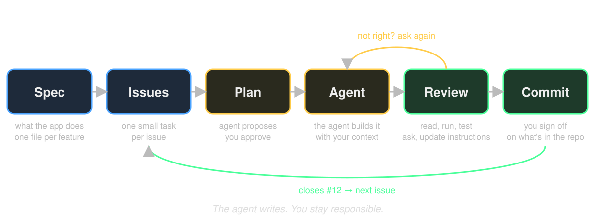

# The final assignment
## Your own app, your way of working

---

# In one sentence

> Build a mobile app on **live data** from a public API, with a coding agent, and show us **how** you worked.

A complete product gets you to a 6. Above that, the product counts most: 80%. How you worked with the agent and how well you understand it: 20%.

---

# Three routes

| | Pokédex | Battle simulator | Your own idea |
|---|---|---|---|
| **What** | The course app, finished and extended | Two Pokémon fight by the real rules | Anything with one clear core action |
| **Design** | Figma, strict | Your own | Your own: a sketch per screen |
| **Specs** | Fixed list (appendix A), plus one feature you design: compare two Pokémon | Fixed list (appendix B) | You write them: 3–6 features |
| **API** | PokeAPI | PokeAPI | PokeAPI or any public API without login. A free key is fine |
| **Approval** | No need | No need | Idea note (day 3), feedback, go on day 4 |

Think about your choice **before day 3**.

---

# Your own idea

**Conditions**
- Live data from a public API. No login, no list you put in the code yourself.
- One clear core action: search, plan, collect, compare, ...
- 3 to 6 features. It meets the technical core.

**Test the API.** Open an endpoint in your browser. JSON back? Usable. Ideas: [public-apis list](https://github.com/public-apis/public-apis).

**The idea note** (template on day 3): the first version of your `product.md`. The idea, core action, 3–6 features, API, what goes in SQLite, which native feature.

**Needs a key?** Free only. In `.env`, never in your repo. Send me the `.env` in Teams.

Not working out? After day 4 you can switch to a starter idea.

---

# What is a good size?

| Good | Too big | Not suitable |
|---|---|---|
| A weather planner on Open-Meteo: pick a city, see the week, save favorite places | A social app with accounts and posts | An API that needs a login, or a paid key |
| A reading list on Open Library: search books, keep what you want to read | A clone of an app with 20 screens | A list of data you type into the code |

One core action, a few screens, live data. If you cannot say it in one sentence, it is two apps.

---

# Technical core (every route)

- Runs in **Expo Go** via QR code
- Live data from a public API with **TanStack Query**
- At least **2 screens** with **Expo Router**
- Something saved in **SQLite** that survives a restart (you pick what)
- Every load has a **loading** and an **error** state
- At least **1 native feature** (Share, haptics, camera, ...)
- **TypeScript** and **ESLint** without errors
- **Logical structure**: UI, data and logic are not mixed

You learn all of this on days 2 and 3. The assignment says **what** the app does, not **how**: you choose, and explain why.

---

---

# How you will work

1. **Spec**: write what the app does, one file per feature. Let the agent ask questions until it is sharp.
2. **Issues**: one small task per GitHub issue.
3. **Plan**: the agent posts a plan and a task list on the issue. You approve it before any code.
4. **Build**: the agent builds one issue, with your spec as context.
5. **Review**: read, run, test. *Ask about it* until you understand it. Update your instructions.
6. **Commit**: `closes #12`. Next issue, new chat.

Today you see this once. Day 4 you do it for real.

---

# What you hand in

One GitHub repo with:

- The **app**
- `specs/`: what the app is, and one file per feature (3–6)
- `AGENTS.md`: what you told the agent about your project
- **GitHub Issues**, closed by commits
- `chat-history/`: the chat of at least one issue, start to finish
- `docs/toelichting.md`: 2 pages, 6 questions

Full git history: no squashing, **never force-push**. Link in Teams before **Friday 6 November 2026, 23:59**.

---

# Your grade

**A 6** when the technical core is complete, everything is handed in, and the app does what your spec says. Missing any of it: a 5 at most.

From 6 to 8:

| Part | Weight | We look at |
|---|---|---|
| Product | 80% | Works, complete, code quality |
| Steering and checking | 10% | Small tasks, context, plan first, own choices, growing instructions. You checked the agent's work |
| Understanding | 10% | Your explanation matches the code |

Bonus, +0.5 each up to a 10: three Reanimated animations, dark mode, infinite scroll, clean TypeScript, pixel-perfect or consistent design, custom font, localisation, zero bugs.

---

# Three skills we grade

**Steering.** One task at a time. Give context: spec, files, instructions. You decide, the agent executes. What you learn about the agent goes into `AGENTS.md`.

**Checking.** Read everything the agent makes. Test it. Wrong? Step in.

**Understanding.** Working with an agent is fast. Losing the overview is faster. After every agent task: **ask about it** until you can explain it in your own words.

---

# One agent chat is part of the grade

- Hand in the chat of **at least one issue**, start to finish: prompt, plan, build, review, ask.
- Any tool, in class and at home: Copilot, Cursor, Claude Code. The examples use Copilot because everyone has it for free.
- Copilot Student has a **monthly limit**. Enough for one issue, not for the whole project. Plan for it.
- We read the chat next to your commits and your explanation. It is **evidence**, not a grade on its own.
- One prompt "build the whole app" followed by "fix it" ×20: we see that.

---

# How to think about AI

**"AI is just another abstraction."**
Assembly → C → JavaScript → React Native → an agent that writes it. Every layer hides work. The layer below is still there, and still your problem when it breaks.

**"A lot of knowledge, a bit less intelligence."**
The model has read more than anyone. But knowledge is not intelligence. It knows everything and just misses *your* situation. That is why it writes a flawless API call and then guesses wrong about what you wanted. Ask the right question and the knowledge turns into a good decision: first *what plays a role here*, then *how do I solve it*.

So: give context, check the output, understand what you ship.

---

# The agent writes.
# You stay responsible.

Everything in your repo, you can explain and defend.

---

# Before day 3

- Think about your route: Pokédex, battle simulator, or your own idea.
- Own idea? Find an API and test it in your browser. On day 3 you get the template for the idea note.
