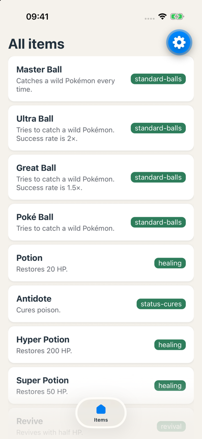

# Exercise 3: Components, twice

### Objective
Build the item list: first a row by hand, then the list with Copilot Chat. Then compare. The point is not the list. The point is seeing what the agent does differently from you.



> **Behind, or no project?** Start from the [exercise 3 starter](./starters/exercise-3/).

### Requirements

1. `src/components/item-row.tsx`: a pressable row with the name, the effect and a category badge, styled with tokens.
2. `src/app/index.tsx`: a `FlatList` of rows, data from `src/constants/items.ts`.
3. `docs/day-2.md`: three sentences about the difference between part A and part B.

### Part A: the row, by hand (20 min)

No Copilot Chat. Autocomplete is fine.

1. **Add data.** Create `src/constants/items.ts`:

   ```ts
   export type Item = { id: number; name: string; category: string; effect: string }

   export const itemData: Item[] = [
     { id: 1, name: 'Master Ball', category: 'standard-balls', effect: 'Catches a wild Pokémon every time.' },
     { id: 2, name: 'Ultra Ball', category: 'standard-balls', effect: 'Tries to catch a wild Pokémon. Success rate is 2×.' },
     { id: 3, name: 'Great Ball', category: 'standard-balls', effect: 'Tries to catch a wild Pokémon. Success rate is 1.5×.' },
     { id: 4, name: 'Poké Ball', category: 'standard-balls', effect: 'Tries to catch a wild Pokémon.' },
     { id: 17, name: 'Potion', category: 'healing', effect: 'Restores 20 HP.' },
     { id: 18, name: 'Antidote', category: 'status-cures', effect: 'Cures poison.' },
     { id: 25, name: 'Hyper Potion', category: 'healing', effect: 'Restores 200 HP.' },
     { id: 26, name: 'Super Potion', category: 'healing', effect: 'Restores 50 HP.' },
     { id: 28, name: 'Revive', category: 'revival', effect: 'Revives with half HP.' },
     { id: 50, name: 'Rare Candy', category: 'vitamins', effect: 'Causes a level-up and raises happiness.' },
   ]
   ```

   The ids and texts are the real ones from PokeAPI. On day 3 you fetch them live.

2. **Build the row.** Create `src/components/item-row.tsx` with an `ItemRow` component that takes `item: Item` and `onPress: () => void`.
   - `Pressable` as the outer element, `flexDirection: 'row'`. Lower the opacity while pressed.
   - Left: the name in bold, the effect below it in `theme.textSecondary` (already in the template).
   - Right: the category as a badge.
   - Colours via `useTheme()`, spacing and radius from `Spacing` and `Radius`. Shadow: `boxShadow`, the same as in CSS.

   > **📚 Reference:** [Pressable](https://reactnative.dev/docs/pressable) · [View](https://reactnative.dev/docs/view) · [Text](https://reactnative.dev/docs/text) · [Flexbox](https://reactnative.dev/docs/flexbox) · [boxShadow](https://reactnative.dev/docs/view-style-props#boxshadow)

3. **Show one row** on the Items screen with `itemData[0]`. `onPress` shows an `Alert` with the name for now.

4. Lint, tsc, commit: `Exercise 3A: ItemRow by hand`.

### Part B: the list, with Copilot Chat (15 min)

1. **Open Copilot Chat in Ask mode.** Open `src/app/index.tsx` and `src/components/item-row.tsx` so they are in context.

2. **Ask for the list.** Be specific. For example:

   > Replace the single row in this screen with a FlatList that renders an ItemRow for every item in itemData from src/constants/items.ts. One column, a gap between the rows from the Spacing tokens. Keep the title above the list.

3. **Read the answer before you paste it.** Does it import from the right files? Does it use `keyExtractor`? Does it invent a colour or a number that should be a token? Change what is wrong, then apply it.

   > **📚 Reference:** [FlatList](https://reactnative.dev/docs/flatlist)

4. **Run it.** List works? Lint and tsc clean? Fix what is not.

5. **Ask one follow-up** about something in the code you did not fully understand. For example: *"What does keyExtractor do, and what happens without it?"* or *"What is the difference between a gap in contentContainerStyle and ItemSeparatorComponent?"*

6. Commit: `Exercise 3B: list with Copilot`.

### Part C: compare (10 min, in class)

Create `docs/day-2.md` and answer in three sentences:

1. What did Copilot do differently from how you built the row?
2. What was better, yours or Copilot's, and why?
3. What in Copilot's code do you not fully understand yet?

Commit: `Exercise 3C: notes`. We discuss the answers together.

### What happens natively

A `FlatList` is a `UIScrollView` / `ScrollView` with only the rows near the screen in it. Rows far off screen are removed, and added again when you scroll back. A `ScrollView` with `.map()` creates all of them at once.

### Done when

- ✅ `ItemRow` built by hand, with tokens
- ✅ List built with Copilot, checked and corrected by you
- ✅ `docs/day-2.md` with three sentences
- ✅ Lint and tsc clean, three commits pushed
