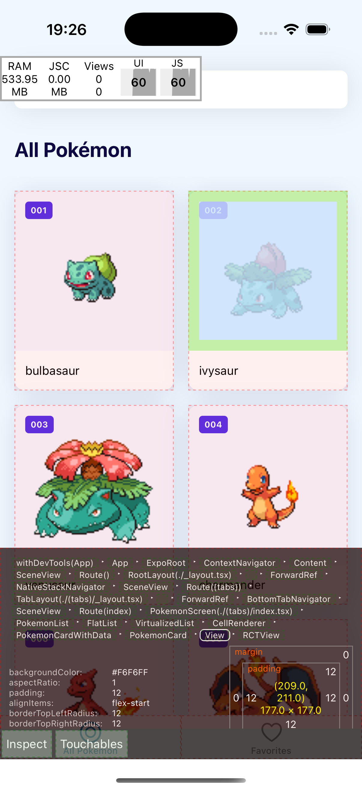
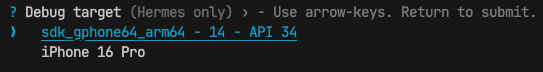

# Debugging and agent mode
## First without AI, then with

---

# The dev menu

Shake your phone, or press `m` in the terminal.

- **Reload**
- **Element inspector**: tap a view, see its size, padding, styles
- **Performance monitor**: FPS on the JS thread and the UI thread



---

# React Native DevTools

Press `j` in the terminal running `expo start`.

- **Console**: your `console.log`, warnings, errors with a stack trace
- **Network**: every `fetch`, with request and response. See exactly what PokeAPI returned.
- **Sources**: breakpoints in your TypeScript



---

# Debugging without AI

1. **Reproduce.** What did you do, what happened, what did you expect?
2. **Locate.** Which file, which line? Console, network tab, a `console.log` at the border.
3. **Read the error.** The first line and the first frame in *your* code.
4. **Form a guess.** "The key is wrong, so the query never refreshes."
5. **Test the guess.** Change one thing. Did it change the outcome?

Agents do the same loop. Faster, and sometimes wrong at step 4.

---

# Agent mode

Until now Copilot **talked**. Now it **acts**: reads files, edits them, runs commands.

| Ask | Agent |
|---|---|
| Answers in the chat | Changes your files |
| You type the code | You review the diff |
| One question | A task with many steps |

More power, more ways to lose track. So: small tasks, good context, review everything.

---

# 1. Small tasks

❌ *"Build the favorites feature."*

✅ *"Add a Share button to the detail screen. Share the text `…`. Do not change anything else."*

One task, one commit. If you cannot review it in five minutes, it is too big.

---

# 2. Context: `copilot-instructions.md`

`.github/copilot-instructions.md` goes with **every** request in this project.

```markdown
Expo app with Expo Router, TypeScript, TanStack Query, expo-sqlite.
- Screens in `app/`, UI in `components/`, API and DB in `services/`, hooks in `hooks/`.
- Colours and spacing from `constants/theme.ts`. Never a hex code in a component.
- Data fetching through TanStack Query hooks. No useEffect + fetch.
- Every async action has a loading and an error state.
- Keep changes small. Do not refactor what you were not asked to touch.
```

Ten lines. The agent follows them more often than not. When it does not: point at them.

---

# 3. Review the diff

Every line. Ask yourself:

- Did it add something I did not ask for?
- Does it follow my instructions?
- Does it handle the error case?
- Would I have written it this way? If not, why not?

Wrong? Say so in the chat. It fixes it. Still wrong? Fix it yourself. **You accept, you own it.**

---

# 4. Lint, types, phone

```bash
npx expo lint
npx tsc --noEmit
```

Then run it on your phone. The agent does not have your phone. It has not seen the share sheet open.

---

# The agent debugging

*"When I favorite a Pokémon, the Favorites tab does not update until I restart. Find the cause and fix it. Explain what was wrong."*

Read the explanation first. Then the diff.

- Did it fix the **cause**, or add a workaround? A `refetch` on focus hides the bug, it does not fix it.
- Does the explanation match the diff?
- Can you reproduce that it is fixed?

---

# Cognitive debt

Working with an agent is fast. Losing the overview of your own codebase is faster.

After a week of accepting diffs you have an app you cannot explain. That is **cognitive debt**: it works, you do not know why, and the next bug takes you a day.

---

# Pay it off: ask about it

After every agent task, before you move on:

- *Why this import? What else is in that module?*
- *What happens when this fails?*
- *Where would this go in my folder structure?*
- *Explain this line like I have never seen it.*

Ask until you can explain it in your own words. Write that down. The chat is evidence; your words are the grade.

---

# Exercise 4

**A.** Write `copilot-instructions.md`.
**B.** Agent builds the Share button. You review, lint, test on your phone.
**C.** Agent fixes a bug. Cause, not workaround.
**D.** Ask about it. Three answers in your own words in `docs/day-2.md`.

C may be homework. D is always in class.

---

# Before day 3: your route

- **Pokédex** or **battle simulator**: tell me in Teams.
- **Own idea**: fill in `day-2/templates/idea.md`, max ten lines, post it in Teams before the holiday ends. One round of feedback, final go on day 3.

That is the homework. It is a holiday.
