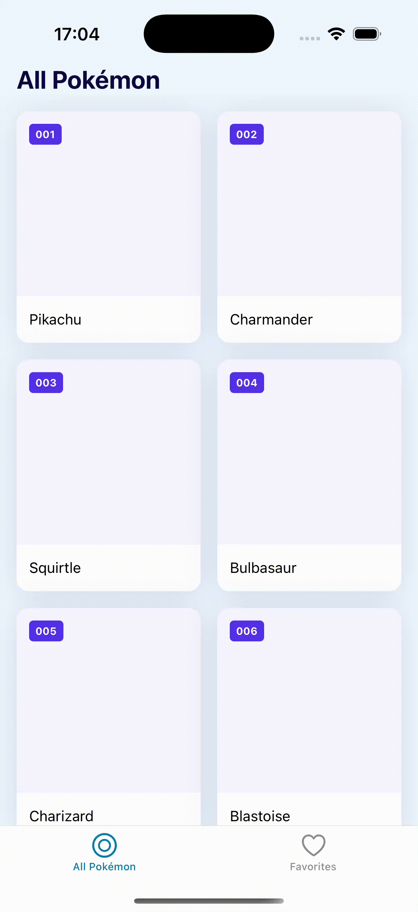

# Data Flow & Debugging

- Review homework: the search bar
- Five kinds of state
- TanStack Query: live data from PokeAPI
- Saving on the phone: SQLite
- Debugging, then **agent mode** for the first time
- At the end: your final assignment route
---

# Review homework

- Show your search bar.
- Where does the query live: component state, or somewhere else?
- What was hard?

