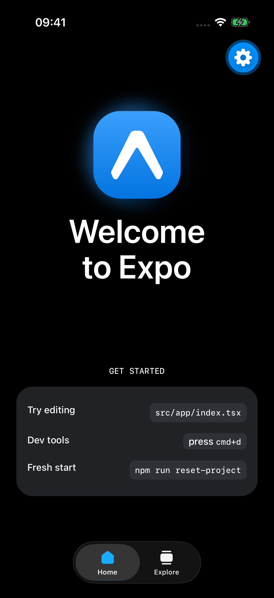

# Day 2: Fundamentals

1. Recap day 1, and make it run for everyone
2. Brief history of hybrid development
3. Styling and theming
4. Exercise 1 - styling and theming
5. Clean up
6. Exercise 2 - clean up: ESLint and TypeScript
7. Components
8. Exercise 3 - components, twice
9. Navigation
10. Exercise 4 - navigation

---

# Recap day 1

- React Native: your code is JavaScript, the UI is real native views.
- Expo Go: run the app on your phone with a QR code.
- Web vs native: the same React, other building blocks.
- Copilot in ask mode: it explains, you check.
- Your Pokedex project runs on your phone and is on GitHub.

Does it run for everyone?

---

# Setup

<style scoped>section { font-size: 24px; }</style>

```bash
node -v                    # LTS: an even number, like 22 or 24
cd Pokedex                 # no project yet? npx create-expo-app Pokedex
npx expo start
```

1. Install **Expo Go** from the App Store or Play Store.
2. Phone and laptop on the **same Wi-Fi**.
3. Scan the QR code. iPhone: camera app. Android: Expo Go app.
4. Wi-Fi blocks it? Use a tunnel, see the next slide.
5. Change a text in `src/app/index.tsx`, save. Your phone updates.

No `src/app/`, or no tab bar? Old template or `reset-project`. Make a new project.



---

# Wi-Fi blocks it? Use a tunnel

1. Make a free account on [expo.dev/signup](https://expo.dev/signup).
2. Log in with that account in **Expo Go** (profile tab).
3. Log in with the same account in the **terminal**:

   ```bash
   npx expo login          # email and password
   npx expo login --sso    # signed up with Google or GitHub
   ```

4. Start with a tunnel and scan the QR code again:

   ```bash
   npx expo start --tunnel
   ```
