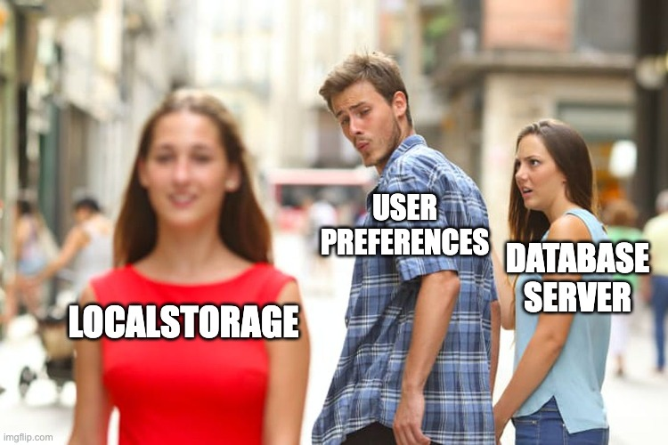

# Local Storage
## Saving data to user's device

---

# When to use local storage?

- No syncing with server needed:
    - Device / user preferences
    - Auth tokens storage
    - Tracking of actions



---

# Types of local storage

- Shared Preferences / User Defaults
- Keychain
- File System
- SQLite

---

# Shared Preferences / User Defaults

- Key-value storage
- Built-in Android/iOS
- Not secure
- Not scalable

## Example: Simple Settings
```typescript
// Store user theme preference
await AsyncStorage.setItem('theme', 'dark');
const theme = await AsyncStorage.getItem('theme');
```

---

# Keychain

- Secure storage
- Built-in Android/iOS
- Secure
- Scalable

## Example: Secure Token Storage
```typescript
// Store authentication token securely
await SecureStore.setItemAsync('authToken', 'jwt_token_here');
const token = await SecureStore.getItemAsync('authToken');
```

---

# File System

- File storage
- Built-in Android/iOS
- Not secure
- Not scalable

## Example: Cache Images
```typescript
// Save downloaded Pokemon image to file system
const fileUri = FileSystem.documentDirectory + 'pokemon_25.jpg';
await FileSystem.writeAsStringAsync(fileUri, imageData, {
  encoding: FileSystem.EncodingType.Base64
});
```

---

# SQLite

- Relational database
- Built-in Android/iOS
- Secure
- Scalable

## Example: Pokemon Favorites Database
```typescript
await addFavorite(25, 'pikachu')
const favorites = await getFavorites()
const liked = await isFavorite(25)
```

---

# What to use to save favorites?

a) File System
b) Keychain
c) Shared Preferences / User Defaults
d) SQLite

---

# What to use to save favorites?

a) File System
b) Keychain
c) Shared Preferences / User Defaults 🤷
d) SQLite 👈


---

# `npx expo install expo-sqlite`

```typescript
// services/favorites-db.ts
import * as SQLite from 'expo-sqlite'

const db = SQLite.openDatabaseSync('pokedex.db')

db.execSync(`
  CREATE TABLE IF NOT EXISTS favorites (
    id INTEGER PRIMARY KEY,
    name TEXT NOT NULL,
    created_at TEXT DEFAULT CURRENT_TIMESTAMP
  );
`)
```

Open once, create the table if it is not there. A module, not a class. Import the functions where you need them.

---

# Create, Read, Delete

```typescript
export async function addFavorite(id: number, name: string) {
  await db.runAsync('INSERT OR REPLACE INTO favorites (id, name) VALUES (?, ?)', [id, name])
}

export async function getFavorites() {
  return db.getAllAsync<{ id: number; name: string }>('SELECT id, name FROM favorites ORDER BY created_at DESC')
}

export async function isFavorite(id: number) {
  const row = await db.getFirstAsync('SELECT id FROM favorites WHERE id = ?', [id])
  return row !== null
}

export async function removeFavorite(id: number) {
  await db.runAsync('DELETE FROM favorites WHERE id = ?', [id])
}
```

`?` placeholders, always. Never glue user input into SQL.

---

# SQLite + TanStack Query

```typescript
useQuery({ queryKey: ['favorites'], queryFn: getFavorites })

useMutation({
  mutationFn: ({ id, name }) => addFavorite(id, name),
  onSuccess: () => queryClient.invalidateQueries({ queryKey: ['favorites'] }),
})
```

- The database is a data source like PokeAPI. Same hook, same loading and error states.
- A **mutation** changes data and then **invalidates** the query. Every screen showing favorites refreshes.
- **Native:** SQLite is the platform's own database library. The file lives in your app's sandbox and survives restarts.

---

# Exercise 3

Favorites in SQLite. Heart on the detail page, Favorites tab from the database, empty state.

Kill the app. Open it. Still there.
