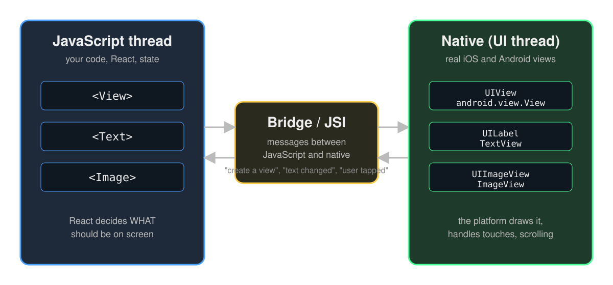
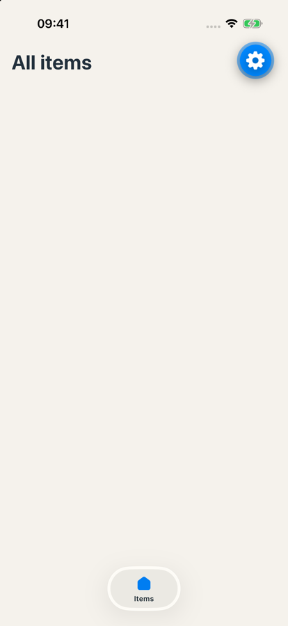

# Styling and theming

---



---

# Remember this picture

Every component you write today becomes a **real native view**.

Ask yourself at every slide: *what happens natively here?*

---

# View

```tsx
<View style={{ flex: 1, padding: 16 }}>
  {/* children */}
</View>
```

- The `<div>` of React Native. Layout and grouping, nothing else.
- Flexbox by default, column direction.
- **Native:** a `UIView` on iOS, a `ViewGroup` on Android.

---

# Text

```tsx
<Text style={{ fontSize: 20, fontWeight: 'bold' }}>Poké Ball</Text>
```

- All text goes inside `<Text>`. A loose string inside a `<View>` gives an error.
- Text styles do not cascade from a `<View>`. Nested `<Text>` inherits.
- **Native:** a `TextView` on Android. On iOS, React Native draws the text itself with the system text engine.

---

# StyleSheet

<style scoped>section { font-size: 26px; }</style>

```tsx
const styles = StyleSheet.create({
  card: {
    flex: 1,
    padding: 16,
    borderRadius: 12,
    backgroundColor: '#fff',
  },
})

<View style={styles.card} />
<View style={[styles.card, { opacity: 0.5 }]} />   // combine
```

- A subset of CSS as objects. Numbers, no units.
- Flexbox everywhere: `flex`, `flexDirection`, `gap`, `alignItems`, `justifyContent`.
- Shadows: `boxShadow: '0 1px 4px rgba(34, 48, 60, 0.12)'`, like CSS, on both platforms.

---

# Safe areas



The notch, the status bar, the home indicator. Your content must not sit under them.

```tsx
import { SafeAreaView } from 'react-native-safe-area-context'

<SafeAreaView edges={['top']} style={{ flex: 1 }}>…</SafeAreaView>
```

`edges={['top']}`: only the top. The list scrolls on behind the tab bar. Already installed in the Expo template. **Native:** the platform tells you the insets; they differ per phone.

---

# Theming: the problem

```tsx
backgroundColor: '#2E7D5B'   // in item-row.tsx
backgroundColor: '#2E7D5B'   // in bag.tsx
backgroundColor: '#2e7d5c'   // in [id].tsx, slightly different
```

Change the brand colour: search 14 files. Dark mode: impossible.

---

# Theming: design tokens

<style scoped>section { font-size: 25px; } pre { font-size: 0.72em; }</style>

One file. Every colour, spacing and radius has a **name**.

```ts
// src/constants/theme.ts (extend the one from the template)
export const Colors = {
  light: {
    text: '#22303C',         // already there: change the value
    background: '#F5F2EC',   // already there: change the value
    card: '#FFFFFF',         // new
    badge: '#2E7D5B',        // new
    badgeText: '#FFFFFF',    // new
  },
  dark: { /* same keys and values for now. Dark mode is a bonus. */ },
} as const;

export const Spacing = { half: 2, one: 4, two: 8, three: 16, /* … */ } // already there
export const Radius = { s: 8, m: 12, l: 16 } as const;               // add this
```

Values come from **the design**. Names come from **what it is for**, not what it looks like: `badge`, not `green`.

---

# Theming: using tokens

<style scoped>pre { font-size: 0.75em; }</style>

```tsx
import { Radius, Spacing } from '@/constants/theme'
import { useTheme } from '@/hooks/use-theme'

const styles = StyleSheet.create({
  card: {
    padding: Spacing.three,
    borderRadius: Radius.m,
  },
})

// colour depends on light / dark, so read it with the hook
const theme = useTheme()
<View style={[styles.card, { backgroundColor: theme.card }]} />
```

**Rule for this course:** no hex code outside `src/constants/theme.ts`. ESLint will not catch it. Your reviewer will.

---

# Next: exercise 1

**Styling and theming.** Items tab, the design colours in `theme.ts`. By hand, no chat.

`day-2/exercises/exercise-1-styling.md`


