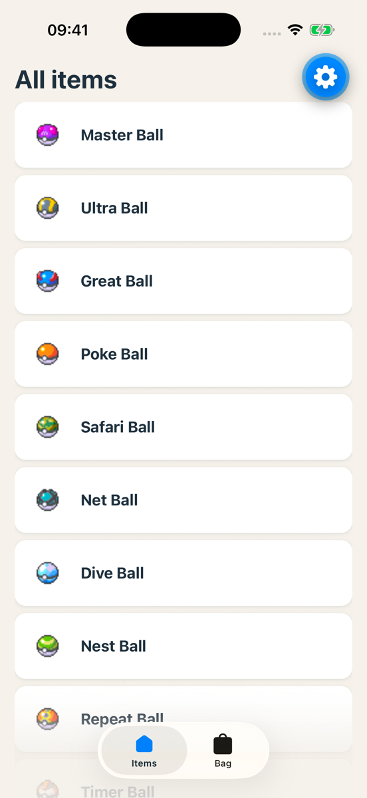

# Exercise 1: Live data with TanStack Query

### Objective
Replace the hardcoded array with live data from PokeAPI, using TanStack Query. Every load shows a loading state and an error state.



Copilot Chat is allowed. Read before you paste. No hex codes outside the theme. Lint and tsc clean at the end.

> **Behind, or no project?** Start from the [exercise 1 starter](./starters/exercise-1/).

### Requirements

1. `src/services/pokeapi.ts`: one function that fetches the first 60 items with `fetch`. No extra API library.
2. `@tanstack/react-query` installed, `QueryClientProvider` around the app.
3. `src/hooks/use-item-list.ts`: a `useQuery` hook around it.
4. The Items tab shows a spinner while loading, a message with a retry button on error, and the list on success. Each row shows the item's sprite.

### Steps to Complete

1. **Look at the API.** Open [pokeapi.co/api/v2/item?limit=60](https://pokeapi.co/api/v2/item?limit=60) in your browser. You get `results`, each with a `name` and a `url`. The id is the last number in the URL. No login, no key: anyone can call it. That is a public API.

   > **📚 Reference:** [PokeAPI docs: items](https://pokeapi.co/docs/v2#items)

2. **Write the service.** Create the folder `src/services/` and the file `src/services/pokeapi.ts`:

   ```ts
   export type ItemListItem = { id: number; name: string; spriteUrl: string };

   const BASE = 'https://pokeapi.co/api/v2';

   export const spriteUrl = (slug: string) =>
     `https://raw.githubusercontent.com/PokeAPI/sprites/master/sprites/items/${slug}.png`;

   // 'master-ball' → 'Master Ball'
   const toTitle = (slug: string) =>
     slug
       .split('-')
       .map((word) => word[0].toUpperCase() + word.slice(1))
       .join(' ');

   export async function fetchItemList(limit = 60): Promise<ItemListItem[]> {
     const res = await fetch(`${BASE}/item?limit=${limit}`);
     if (!res.ok) throw new Error(`PokeAPI responded with ${res.status}`);
     const json: { results: { name: string; url: string }[] } = await res.json();
     return json.results.map((r) => ({
       id: Number(r.url.split('/').filter(Boolean).pop()),
       name: toTitle(r.name),
       spriteUrl: spriteUrl(r.name),
     }));
   }
   ```

   The `if (!res.ok) throw` matters: `fetch` does **not** throw on a 404 or 500. Without it, your error state never shows.

   > **📚 Reference:** [Using the Fetch API](https://developer.mozilla.org/en-US/docs/Web/API/Fetch_API/Using_Fetch)

3. **The old way first.** Before any library: fetch the list with `useState` and `useEffect`, the way you know from React. In `src/app/(tabs)/index.tsx`:

   ```tsx
   import { useEffect, useState } from 'react';

   import { fetchItemList, ItemListItem } from '@/services/pokeapi';

   // in ItemsScreen, instead of itemData:
   const [items, setItems] = useState<ItemListItem[]>([]);

   useEffect(() => {
     fetchItemList().then(setItems);
   }, []);

   // and in the JSX:
   <ItemList items={items} />
   ```

   Update `ItemRow` and `ItemList` to the new `ItemListItem` type. The row shows the sprite and the name: `<Image source={{ uri: item.spriteUrl }} style={{ width: 40, height: 40 }} />`. The list has no category or effect. Those come on the detail screen in exercise 2. `bag.tsx` now shows a type error: step 9 fixes it.

   Save. The list shows 60 live items. Now look at what is missing:
   - Restart the app. What do you see before the list comes? Nothing: there is no loading state.
   - Turn on airplane mode and restart. An empty list, no message for the user, no way to try again. Only a yellow warning in development.
   - The Bag tab needs the same list. Copy the `useEffect`? Then the app fetches the same data twice.

   You can build all of that yourself: more `useState`, a `try`/`catch`, a shared store. TanStack Query does it for you.

   > **📚 Reference:** [useEffect](https://react.dev/reference/react/useEffect) · [Image](https://reactnative.dev/docs/image)

4. **Install.** `expo install` picks the version that fits your SDK.

   ```bash
   npx expo install @tanstack/react-query
   ```

   > **📚 Reference:** [TanStack Query: installation](https://tanstack.com/query/latest/docs/framework/react/installation)

5. **Provide the client.** In `src/app/_layout.tsx`, create one `QueryClient` outside the component and wrap the `<Stack>` in `<QueryClientProvider client={queryClient}>`. The `ThemeProvider` from the template stays around it.

   ```tsx
   import { QueryClient, QueryClientProvider } from '@tanstack/react-query';

   const queryClient = new QueryClient();
   ```

   VS Code does not suggest this import yet: it does not know a package until you import it once. Type it yourself.

   > **📚 Reference:** [Quick start](https://tanstack.com/query/latest/docs/framework/react/quick-start)

6. **Write the hook.** Create `src/hooks/use-item-list.ts`:

   ```ts
   import { useQuery } from '@tanstack/react-query';

   import { fetchItemList } from '@/services/pokeapi';

   export const useItemList = () =>
     useQuery({ queryKey: ['item', 'list'], queryFn: () => fetchItemList() });
   ```

   > **📚 Reference:** [useQuery](https://tanstack.com/query/latest/docs/framework/react/reference/useQuery) · [Query keys](https://tanstack.com/query/latest/docs/framework/react/guides/query-keys)

7. **An error component.** Create `src/components/error-view.tsx` with the props `message: string` and `onRetry: () => void`. It shows the message and a `Pressable` "Try again" that calls `onRetry`. Colours from the theme. You use it on three screens today.

8. **Use it.** In `src/app/(tabs)/index.tsx`, delete the `useState` and the `useEffect` from step 3. Put `const { data, isPending, error, refetch } = useItemList()` in their place.
   - `data`: the list.
   - No `data` and `isPending`: an `ActivityIndicator`.
   - Otherwise: `<ErrorView message={error.message} onRetry={refetch} />`.

   The order matters: check `data` first. TanStack can have `data` and `error` at the same time: the list is in the cache, a new fetch in the background fails. Check `error` first and an error screen hides a list that works.

   ```tsx
   {data ? (
     <ItemList items={data} />
   ) : isPending ? (
     <ActivityIndicator />
   ) : (
     <ErrorView message={error.message} onRetry={refetch} />
   )}
   ```

   Compare with step 3: three states, and no `useEffect`.

   > **📚 Reference:** [ActivityIndicator](https://reactnative.dev/docs/activityindicator)

9. **Bag tab.** In `bag.tsx`, use the same hook for now: `<ItemList items={data?.slice(0, 2) ?? []} />`. In exercise 3, the bag comes from SQLite.

   The detail screen still reads `src/constants/items.ts`. That file has only ten items, so most rows now open "not found". That is fine: exercise 2 fixes it.

10. **Test all three states.** Loading: restart the app and watch. Error: turn on airplane mode, restart the app, press "Try again", turn airplane mode off, press again. Success: the list. Then switch tabs and back: instant, from the cache.

11. **Lint, tsc, commit.** Message: `Exercise 1: item list from PokeAPI`.

### What happens natively

`fetch` gives the request to the networking stack of the platform (`URLSession` on iOS, `OkHttp` on Android). The JavaScript thread does not wait. The response comes back later. That is why the UI keeps scrolling while data loads. `<Image>` with a URL also downloads and caches the picture natively.

### Done when

- ✅ The list comes from PokeAPI: 60 items with sprites
- ✅ Spinner while loading, message and retry on error
- ✅ Lint and tsc clean, committed and pushed
