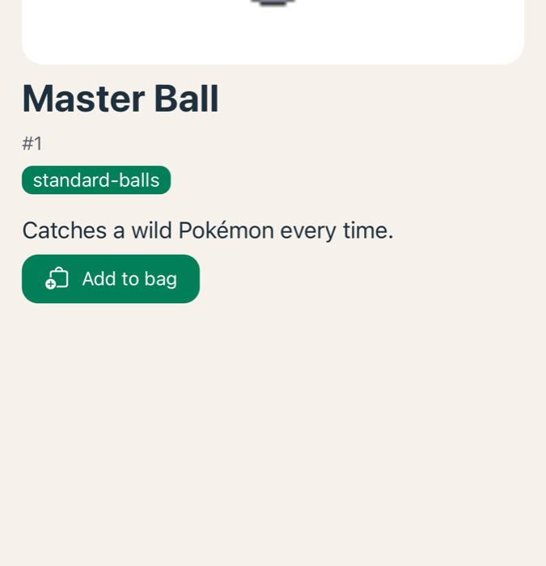
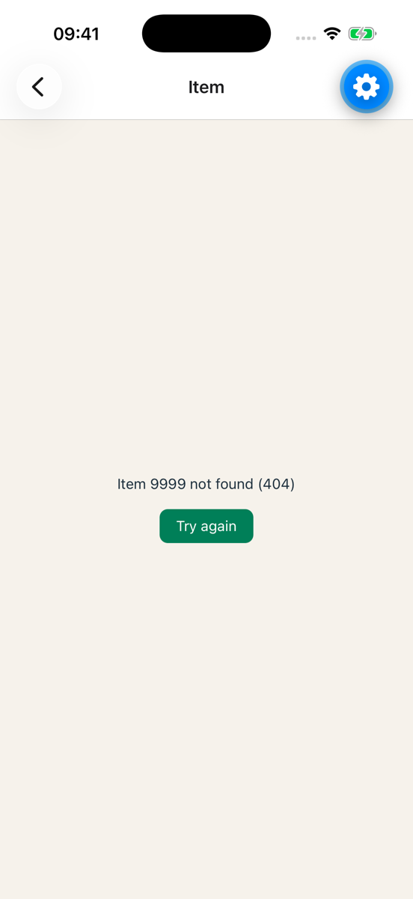

# Exercise 2: Detail page from PokeAPI

### Objective
The detail screen loads its own item from PokeAPI: sprite, name, category and effect. With loading and error states.



> **Behind, or no project?** Start from the [exercise 2 starter](./starters/exercise-2/).

### Requirements

1. `src/services/pokeapi.ts`: `fetchItem(id)` returning id, name, sprite, category and effect.
2. `src/hooks/use-item.ts`: `useItem(id)` with query key `['item', id]`.
3. `src/app/item/[id].tsx` shows loading, error and the data.
4. `src/constants/items.ts` is gone.

### Steps to Complete

1. **Look at one item.** Open [pokeapi.co/api/v2/item/17](https://pokeapi.co/api/v2/item/17). Find `id`, `name`, `category.name`, `names` (the name per language) and `effect_entries` (the effect per language, with a `short_effect`). There is also `sprites.default`: the same URL as your `spriteUrl`. The response is big. You only type the part you use.

   > **📚 Reference:** [PokeAPI: Item](https://pokeapi.co/docs/v2#item)

2. **Type only what you need.** Add to `src/services/pokeapi.ts`:

   ```ts
   export type Item = ItemListItem & { category: string; effect: string };

   type ItemResponse = {
     id: number;
     name: string;
     names: { name: string; language: { name: string } }[];
     category: { name: string };
     effect_entries: { short_effect: string; language: { name: string } }[];
   };

   export async function fetchItem(id: number): Promise<Item> {
     const res = await fetch(`${BASE}/item/${id}`);
     if (!res.ok) throw new Error(`Item ${id} not found (${res.status})`);
     const i: ItemResponse = await res.json();
     return {
       id: i.id,
       name: i.names.find((n) => n.language.name === 'en')?.name ?? toTitle(i.name),
       spriteUrl: spriteUrl(i.name),
       category: i.category.name,
       effect: i.effect_entries.find((e) => e.language.name === 'en')?.short_effect ?? 'No effect text.',
     };
   }
   ```

   The service maps the response to your own shape. Your screens do not see the names from the API. Not every item has an English effect: the `??` gives a fallback text.

3. **The hook.** `src/hooks/use-item.ts`:

   ```ts
   export const useItem = (id: number) =>
     useQuery({ queryKey: ['item', id], queryFn: () => fetchItem(id), enabled: Number.isFinite(id) });
   ```

   Why does the key contain the id? Ask Copilot, then check the docs.

   > **📚 Reference:** [Query keys](https://tanstack.com/query/latest/docs/framework/react/guides/query-keys) · [Dependent queries and `enabled`](https://tanstack.com/query/latest/docs/framework/react/guides/dependent-queries)

4. **The screen.** In `src/app/item/[id].tsx`, replace the `itemData.find(...)` with `useItem(Number(id))`. The same three states as exercise 1, with your `ErrorView`. On success:
   - the sprite large at the top, in a card (96 × 96)
   - name and id
   - the category in a badge, colour from the theme
   - the effect

   Keep `<Stack.Screen options={{ title: item.name }} />`.

   > **📚 Reference:** [Stack.Screen options](https://docs.expo.dev/router/advanced/stack/#configure-header-bar)

5. **Clean up.** Delete `src/constants/items.ts`. Lint and tsc tell you if something still uses it.

6. **Test.** Open a few items. Then change `router.push` in `item-list.tsx` to `/item/9999` for a moment: the error state must show, not a crash. It takes a few seconds, because TanStack tries three times. Change it back. Open the same item twice: the second time is instant.

   

7. **Lint, tsc, commit.** Message: `Exercise 2: detail from PokeAPI`.

### Done when

- ✅ Every item opens with its own data: sprite, name, category, effect
- ✅ Loading and error states, no crash on an unknown id
- ✅ Second visit comes from the cache
- ✅ `src/constants/items.ts` is deleted
- ✅ Lint and tsc clean, committed and pushed
