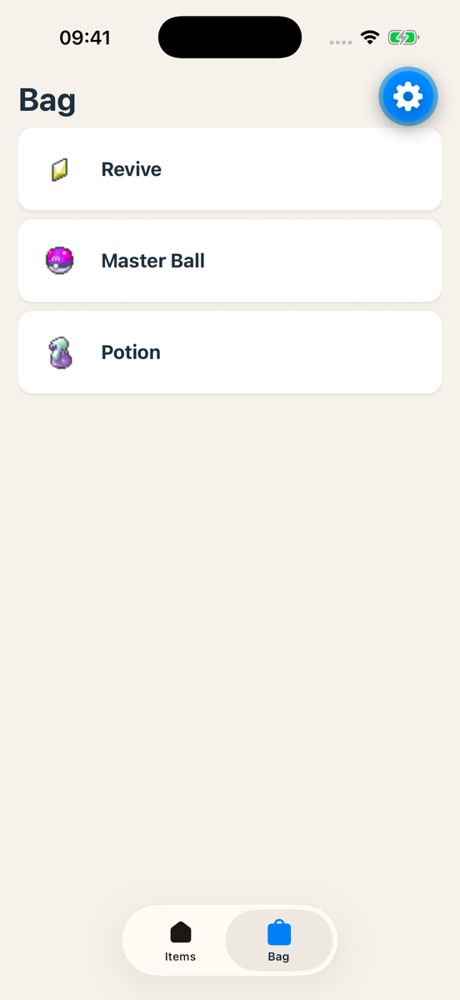

# Exercise 3: The bag in SQLite

### Objective
Save the bag on the phone with SQLite. It stays after a restart. The Bag tab reads from the database and has an empty state.



> **Behind, or no project?** Start from the [exercise 3 starter](./starters/exercise-3/).

### Requirements

1. `expo-sqlite` installed. `src/services/bag-db.ts` with four functions: `getBag`, `isInBag`, `addToBag`, `removeFromBag`.
2. `src/hooks/use-bag.ts`: a query for the list and a mutation to add or remove, both through TanStack Query.
3. An "Add to bag" button on the detail screen. The Bag tab shows the saved items, or a message when the bag is empty.
4. Kill the app, open it again: the bag is still full.

### Steps to Complete

1. **Install.**

   ```bash
   npx expo install expo-sqlite
   ```

   > **📚 Reference:** [Expo SQLite](https://docs.expo.dev/versions/latest/sdk/sqlite/)

2. **The database module.** Create `src/services/bag-db.ts`. Open the database once, create the table if it is not there, export plain functions. You do not need a class.

   ```ts
   import * as SQLite from 'expo-sqlite';

   import { type ItemListItem } from './pokeapi';

   const db = SQLite.openDatabaseSync('items.db');

   db.execSync(`
     CREATE TABLE IF NOT EXISTS bag (
       id INTEGER PRIMARY KEY,
       name TEXT NOT NULL,
       sprite_url TEXT NOT NULL,
       created_at TEXT DEFAULT CURRENT_TIMESTAMP
     );
   `);

   type Row = { id: number; name: string; sprite_url: string };

   export async function getBag(): Promise<ItemListItem[]> {
     const rows = await db.getAllAsync<Row>('SELECT id, name, sprite_url FROM bag ORDER BY created_at DESC');
     return rows.map((r) => ({ id: r.id, name: r.name, spriteUrl: r.sprite_url }));
   }

   export async function isInBag(id: number): Promise<boolean> {
     const row = await db.getFirstAsync('SELECT id FROM bag WHERE id = ?', [id]);
     return row !== null;
   }

   export async function addToBag(item: ItemListItem): Promise<void> {
     await db.runAsync('INSERT OR REPLACE INTO bag (id, name, sprite_url) VALUES (?, ?, ?)', [
       item.id,
       item.name,
       item.spriteUrl,
     ]);
   }

   export async function removeFromBag(id: number): Promise<void> {
     await db.runAsync('DELETE FROM bag WHERE id = ?', [id]);
   }
   ```

   The `?` placeholders keep user input out of your SQL.

   > **📚 Reference:** [expo-sqlite API: `runAsync`, `getAllAsync`, `getFirstAsync`](https://docs.expo.dev/versions/latest/sdk/sqlite/#sqlitedatabase)

3. **Hooks.** Create `src/hooks/use-bag.ts`. The list is a query, like PokeAPI. A change is a mutation that invalidates the query, so every screen refreshes.

   ```ts
   import { useMutation, useQuery, useQueryClient } from '@tanstack/react-query';

   import * as bagDb from '@/services/bag-db';
   import { type ItemListItem } from '@/services/pokeapi';

   export const useBag = () => useQuery({ queryKey: ['bag'], queryFn: bagDb.getBag });

   export const useIsInBag = (id: number) =>
     useQuery({ queryKey: ['bag', id], queryFn: () => bagDb.isInBag(id) });

   export const useToggleBag = () => {
     const queryClient = useQueryClient();
     return useMutation({
       mutationFn: ({ item, inBag }: { item: ItemListItem; inBag: boolean }) =>
         inBag ? bagDb.removeFromBag(item.id) : bagDb.addToBag(item),
       onSuccess: () => queryClient.invalidateQueries({ queryKey: ['bag'] }),
     });
   };
   ```

   Why does invalidating `['bag']` also refresh `['bag', 17]`? Look it up.

   > **📚 Reference:** [Mutations](https://tanstack.com/query/latest/docs/framework/react/guides/mutations) · [Query invalidation](https://tanstack.com/query/latest/docs/framework/react/guides/query-invalidation)

4. **The bag button.** Create `src/components/bag-button.tsx` with the prop `item: ItemListItem`. It uses `useIsInBag(item.id)` and `useToggleBag()`. A `Pressable` with an icon and the text "Add to bag" or "Remove from bag". `expo-symbols` is in the template:

   ```tsx
   <SymbolView
     name={
       inBag
         ? { ios: 'bag.badge.minus', android: 'remove_shopping_cart' }
         : { ios: 'bag.badge.plus', android: 'add_shopping_cart' }
     }
     tintColor={theme.badgeText}
     size={20}
   />
   ```

   Colours from the theme. Disable the `Pressable` while `isPending`. Put the button below the effect on the detail screen.

   > **📚 Reference:** [Expo Symbols](https://docs.expo.dev/versions/latest/sdk/symbols/)

5. **Bag tab.** In `src/app/(tabs)/bag.tsx`, replace `useItemList()` with `useBag()`. The same three states. An empty array: show a short message, for example "Your bag is empty. Open an item and tap “Add to bag”". Reuse `ItemList`.

6. **Test.** Add three items. Check the tab. Kill the app completely (swipe it away), then open it again. Still three? Remove one from its detail screen, go back to the tab: gone, without a reload.

7. **Lint, tsc, commit.** Message: `Exercise 3: bag in SQLite`.

### What happens natively

SQLite is a real database file on the phone, in the sandbox of your app. `expo-sqlite` is a native module around SQLite: your JavaScript calls it directly. The file stays until the user deletes the app. That is why your bag stays after a restart. A key-value store would also work here. We use SQLite because later you will want queries.

### Done when

- ✅ The button on the detail screen adds and removes, and is disabled while it saves
- ✅ The Bag tab reads from SQLite, with loading, error and empty states
- ✅ The bag stays after you kill the app
- ✅ Lint and tsc clean, committed and pushed
