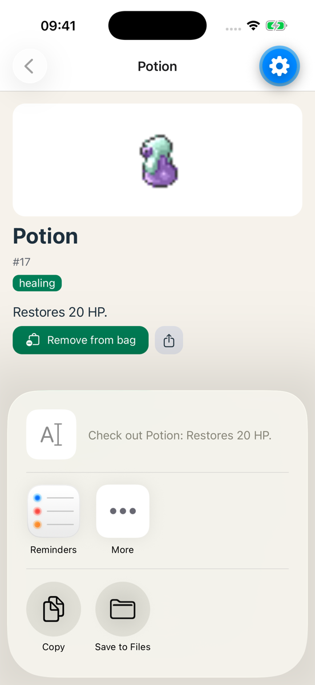

# Exercise 4: Agent mode

### Objective
Let Copilot write code for the first time, on your terms. Small task, good context, a plan first, every line reviewed, then ask until you understand it.

This is the way of working we grade in the final assignment. Five parts: A instructions, B build, C fix two bugs, D ask, E update your instructions.

> **Behind, or no project?** Start from the [exercise 4 starter](./starters/exercise-4/).

### Requirements

1. `AGENTS.md` in the root of your repo, with about ten lines of your own on top.
2. A Share button on the detail screen, built by the agent, reviewed by you, working on your phone.
3. Two bugs fixed: one by you, one by the agent.
4. `docs/day-3.md` with your answers to three questions about the Share code.
5. `AGENTS.md` updated with at least one rule you learned in B or C.

### Part A: instructions (5 min)

Every agent tool reads `AGENTS.md` in the root of your repo with every request: Copilot, Cursor, Claude Code. It is the file you saw in the React lessons. Copilot needs the VS Code setting `chat.useAgentsMdFile` turned on (day 1 setup). Check that first.

The Expo template already made an `AGENTS.md` (and a `CLAUDE.md` that points to it). Read it: those are Expo's general rules, like "use `npx expo install`". Keep them. Your project is not in there yet.

Add a section **at the top** with what a new colleague would need to know about **your** app. Example, adapt it to your project:

```markdown
# Item catalogue

Expo (React Native) app with Expo Router, TypeScript, TanStack Query and expo-sqlite. Runs in Expo Go.

- Screens live in `src/app/`, reusable UI in `src/components/`, API and database code in `src/services/`, hooks in `src/hooks/`.
- All colours, spacing and radii come from `src/constants/theme.ts`. Never write a hex code in a component.
- Data fetching goes through TanStack Query hooks in `src/hooks/`. No `useEffect` + `fetch` in screens.
- Every async action has a loading and an error state.
- Prefer `Pressable` over `TouchableOpacity`. Use `expo-*` packages over community ones.
- Install packages with `npx expo install`.
- Keep changes small. Do not refactor files you were not asked to touch.
```

**Check that it works.** Open a new chat, attach no files, and ask:

> What do you know about this project?

Does it name your stack and your rules? Then the file is read. It also shows up under **References** below the answer. Does it answer in general terms? Check the path and the file name.

Commit: `Exercise 4A: AGENTS.md`.

> **📚 Reference:** [AGENTS.md](https://agents.md/) · [AGENTS.md in Copilot](https://code.visualstudio.com/docs/copilot/copilot-customization#_custom-instructions)

### Part B: the Share button (18 min)

1. **Switch the chat to Agent.** Open `src/app/item/[id].tsx` so it is in context.

2. **Give one small task, and ask for a plan first.** For example:

   > Add a Share button to the item detail screen, next to the bag button. On press, use the Share API from react-native to share the text "Check out {name}: {effect}". Follow the project instructions. Do not change anything else. First give me a plan: which files, what you change. No code yet.

3. **Check the plan.** Does it stay in the detail screen? Does it want a new dependency or a new file? Wrong? Say what to change. Right? Say "go".

4. **Watch what it does.** The agent reads files, proposes edits, may run commands. Do not accept yet.

5. **Review the diff.** Go through every changed line. Checklist:
   - Did it add something you did not ask for? A new dependency, a refactor, a new file?
   - Does it follow your instructions? Tokens, not hex. `Pressable`, not `TouchableOpacity`.
   - Does the Share call handle failure? `Share.share` can reject.
   - What would you have done differently?

   Wrong? Tell the agent, in the same chat, what to change. Right? Accept.

   Rejected or changed something? Write it down in `docs/day-3.md`. The final assignment asks for one example.

   > **📚 Reference:** [Share API](https://reactnative.dev/docs/share)

6. **Lint, tsc, test on your phone.** The native share sheet must open. Share it to yourself.

   

7. Commit: `Exercise 4B: share button (agent)`.

### Part C: fix two bugs (20 min)

Two small apps, each with one bug. The first one you find yourself, the second one the agent fixes. Copy each folder to your own place, then `npm install` and `npx expo start`.

**C1. Yourself, no AI (10 min).** Start [`debug-yourself`](./starters/debug-yourself/). Tap any item: the detail screen shows an error. Find the cause with the five steps from the slides: reproduce, locate, read the error, guess, test. Press `j` and look at the **Network** tab: what does the app ask PokeAPI for? Fix it. Write in `docs/day-3.md` how you found it.

> **📚 Reference:** [React Native DevTools](https://reactnative.dev/docs/react-native-devtools)

**C2. With the agent (10 min).** Start [`debug-agent`](./starters/debug-agent/). Tap "Add to bag": the button does not change, and the Bag tab does not update until you restart. Do not look for the cause yourself. Let the agent fix it:

> When I add an item to the bag, the Bag tab does not update until I restart the app. Find the cause and fix it. Explain what was wrong.

Read the explanation. Is that the actual cause? Read the diff. Did it fix the cause, or work around it (a refetch on focus, a `useEffect`)? A workaround is not a fix. Push back if needed.

Which bug was harder to find: yours, or the agent's? Write one sentence about it in `docs/day-3.md`.

### Part D: ask about it (10 min)

Working with an agent is fast. Losing track of your own codebase is faster. So after every agent task: **ask until you can explain it**.

Ask the agent (Ask mode is fine) three questions about the Share code. Examples, or pick your own:

- Why this import, and what else is in that module?
- What happens if sharing fails or the user cancels? Where is that handled?
- Where would this code go in my folder structure if I wanted to reuse it on the list screen?

Write the answers **in your own words** in `docs/day-3.md`. Not a copy of the chat. Commit: `Exercise 4D: notes`.

### Part E: update your instructions (5 min)

Look back at B and C. Did you correct the agent, or explain something it could have known? A hex code instead of a token. A `TouchableOpacity`. A workaround instead of a fix. A dependency you did not want.

Every one of those becomes a rule in `AGENTS.md`. One line each, for example:

```markdown
- Fix the cause of a bug, not the symptom. No refetch-on-focus to hide a stale query.
```

Nothing to correct? Then add the rule you were most afraid it would break.

This is the last step of every agent task from now on. The file grows with your project, and the commits on it show how you learned to steer.

Commit: `Exercise 4E: update instructions`.

### Done when

- ✅ `AGENTS.md` in the repo, and the check "What do you know about this project?" names your rules
- ✅ Share works on your phone, you can explain every line of the diff
- ✅ Two bugs fixed: one by you, one by the agent. Cause and fix understood
- ✅ `docs/day-3.md` with how you found bug C1, and three answers in your own words
- ✅ `AGENTS.md` has at least one new rule from B or C
- ✅ Commits for A, B, D and E, lint and tsc clean
