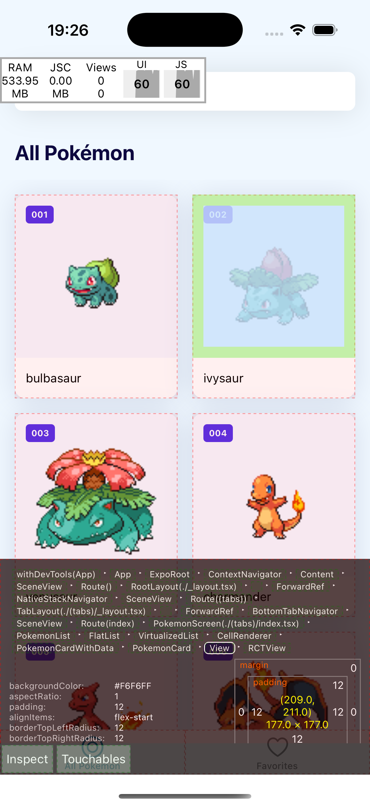
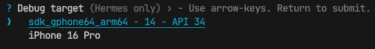

# Debugging and agent mode
## First without AI, then with

---

# The dev menu

Shake your phone, or press `m` in the terminal.

- **Reload**
- **Element inspector**: tap a view, see its size, padding, styles
- **Performance monitor**: FPS on the JS thread and the UI thread



---

# React Native DevTools

Press `j` in the terminal running `expo start`.

- **Console**: your `console.log`, warnings, errors with a stack trace
- **Network**: every `fetch`, with request and response. See exactly what PokeAPI returned.
- **Sources**: breakpoints in your TypeScript



---

# Debugging without AI

1. **Reproduce.** What did you do, what happened, what did you expect?
2. **Locate.** Which file, which line? Console, network tab, a `console.log` at the border.
3. **Read the error.** The first line and the first frame in *your* code.
4. **Form a guess.** "The key is wrong, so the query never refreshes."
5. **Test the guess.** Change one thing. Did it change the outcome?

Agents do the same loop. Faster, and sometimes wrong at step 4.

---

# Agent mode

Until now Copilot **talked**. Now it **acts**: reads files, edits them, runs commands.

| Ask | Agent |
|---|---|
| Answers in the chat | Changes your files |
| You type the code | You review the diff |
| One question | A task with many steps |

More power, more ways to lose track. So: small tasks, good context, review everything.

---

# 1. Small tasks

❌ *"Build the bag feature."*

✅ *"Add a Share button to the detail screen. Share the text `…`. Do not change anything else."*

One task, one commit. If you cannot review it in five minutes, it is too big.

---

# 2. Context: `AGENTS.md`

`AGENTS.md` in the root of your repo goes with **every** request in this project.

```markdown
Expo app with Expo Router, TypeScript, TanStack Query, expo-sqlite.
- Screens in `src/app/`, UI in `src/components/`, API and DB in `src/services/`, hooks in `src/hooks/`.
- Colours and spacing from `src/constants/theme.ts`. Never a hex code in a component.
- Data fetching through TanStack Query hooks. No useEffect + fetch.
- Every async action has a loading and an error state.
- Keep changes small. Do not refactor what you were not asked to touch.
```

A few lines of your own, above what Expo already put in the file. The agent follows them more often than not. When it does not: point at them.

The same `AGENTS.md` from the React lessons. Cursor and Claude Code read it too. Copilot: VS Code setting `chat.useAgentsMdFile` on (day 1).

---

# Does it actually read it?

New chat. No files attached. Ask:

> *What do you know about this project?*

- Names your stack and your rules? It works.
- The file is listed under **References** below the answer.
- Generic answer about Expo? Check: `AGENTS.md` in the root, and the setting `chat.useAgentsMdFile` on.

Good to double check on new projects.

---

# 3. Plan first

Before any code, ask for a plan:

> *Add a Share button to the detail screen. First give me a plan: which files, what you change. No code yet.*

- Does it stay in the files you expect?
- Does it want a dependency you did not ask for?
- Wrong? Say so. Right? Say **go**.

Fixing a plan takes one line. Fixing the code takes much longer.

---

# 4. Review the diff

Every line. Ask yourself:

- Did it add something I did not ask for?
- Does it follow my instructions?
- Does it handle the error case?
- Would I have written it this way? If not, why not?

Wrong? Say so in the chat. It fixes it. Still wrong? Fix it yourself.

Rejected or changed something? Write it down: the final assignment asks for one.

---

# 5. Lint, types, phone

```bash
npx expo lint
npx tsc --noEmit
```

Then run it on your phone. The agent does not have your phone. It has not seen the share sheet open.

---

# The agent debugging

*"When I add an item to the bag, the Bag tab does not update until I restart. Find the cause and fix it. Explain what was wrong."*

Read the explanation first. Then the diff.

- Did it fix the **cause**, or add a workaround? A `refetch` on focus hides the bug, it does not fix it.
- Does the explanation match the diff?
- Can you reproduce that it is fixed?

---

# Cognitive debt

Working with an agent is fast. Losing the overview of your own codebase is faster.

After a week of accepting diffs you have an app you cannot explain. That is **cognitive debt**: it works, you do not know why, and the next bug takes you a day.

---

# Pay it off: ask about it

After every agent task, before you move on:

- *Why this import? What else is in that module?*
- *What happens when this fails?*
- *Where would this go in my folder structure?*
- *Explain this line like I have never seen it.*

Ask until you can explain it in your own words. Write that down.

---

# Then: update your instructions

Did you correct the agent? Explain something it could have known?

- A hex code instead of a token
- A workaround instead of a fix
- A dependency you did not want

Each one becomes **a line in `AGENTS.md`**. Commit it.

The file grows with your project. Your commits on it show how you learned to steer. Last step of every agent task, from now on.

---

# Next: exercise 4

**A.** Write `AGENTS.md`.
**B.** Agent plans, then builds the Share button. You check the plan, review, lint, test on your phone.
**C.** Ask about it. Three answers in your own words in `docs/day-3.md`.
**D.** Update your instructions. One new rule from B, committed.

All four in class, about 40 minutes.

---

# Day 4

- More agentic development: spec, issues, plan, review.
- Start your own project: Pokédex, battle simulator, or your own idea.

The [final assignment](https://github.com/kevinvandenhoek/inholland-react-native-course/blob/main/exam/README.md) is already online. Want to start early? Go ahead.
