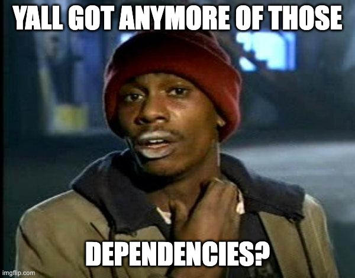
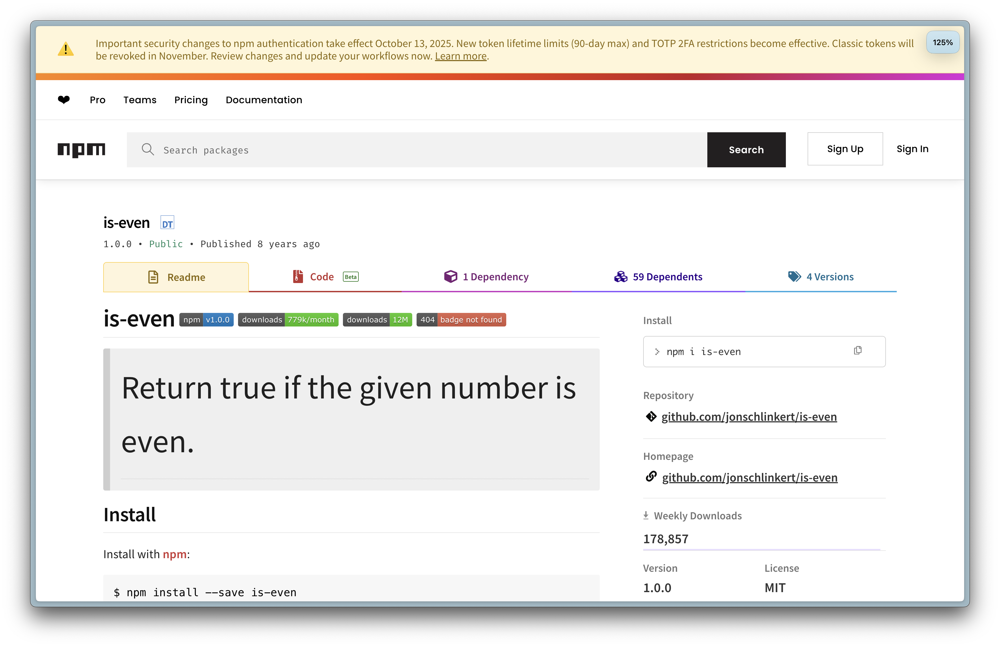
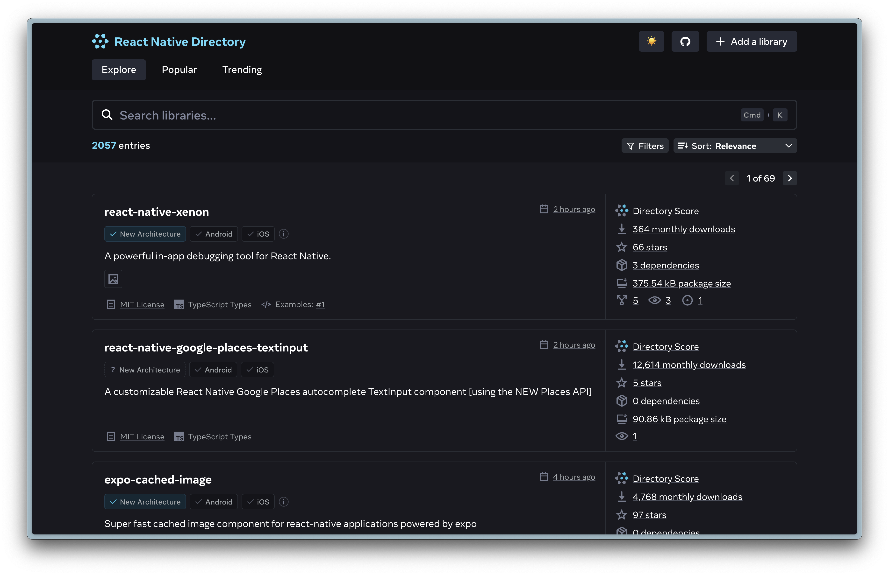
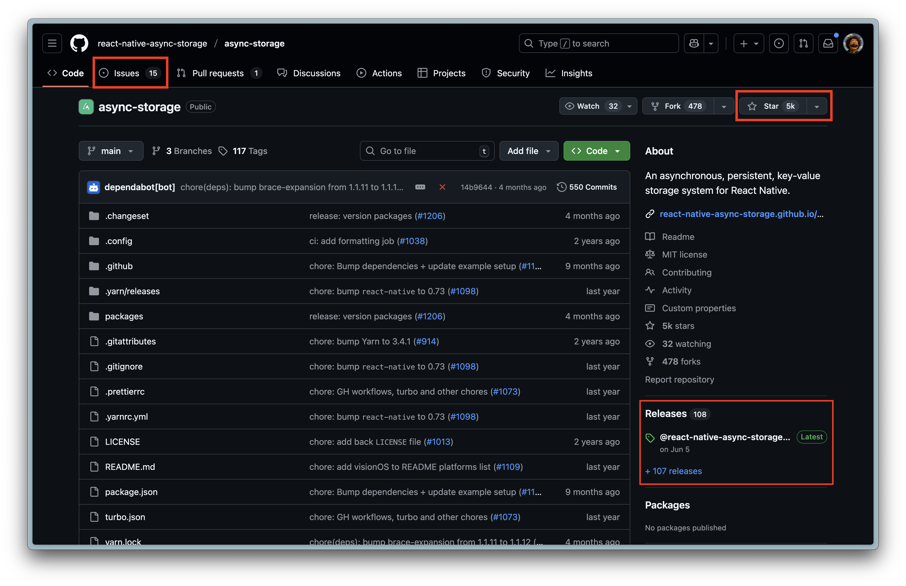

# Dependencies
## Making the right choice



---

## What to look for

- 🔨 **Validity check**: can I build it?
- ✅ **Compatibility check**: does it work?
- ❤️‍🩹 **Health check**: is it maintained?

🌲 [Excalidraw Decision Tree](https://link.excalidraw.com/readonly/B3qFAd2vdrdWVlKcQFHj?darkMode=true)

---

# 🔨 Validity check
https://github.com/i-voted-for-trump/is-even



---

# 🔨 Validity check

- Can (A)I build it?
- Does it solve the problem?
- Any mitigations? (performance loss, refactors required)

---

# ✅ Compatibility check

- [React Native Directory](https://reactnative.directory/)
- [Expo SDK](https://docs.expo.dev/versions/latest/sdk/)



---
# ✅ Compatibility check

- Version support?
- Any Github issues (Android/iOS)

---

# ❤️‍🩹 Health check

- https://github.com/markneh/react-native-esim
VS
- https://github.com/odemolliens/react-native-sim-cards-manager



---

# ❤️‍🩹 Health check

- Recent releases?
- Activity on Github issues?
- Rich contributions or stars?
- Documentation?
- Tests, passing CI/CD, etc.
- Secure? [Shai Hulud anyone?](https://www.stepsecurity.io/blog/ctrl-tinycolor-and-40-npm-packages-compromised)

---

# The agent will add dependencies

It reaches for a package the way it saw others do it. It does not know
whether that package works in Expo Go, or whether it was last updated in 2019.

- Say it in your instructions: **ask before adding a dependency**.
- Check the diff for changes to `package.json` you did not ask for.
- Run the three checks yourself. The agent is not accountable, you are.

---

# In Expo, install like this

```bash
npx expo install <package>
```

Picks the version that matches your SDK, instead of the newest one on npm.

Needs native code and is not in the Expo SDK? Then it does not run in Expo Go.
For this course that means: **do not use it.**

---

# Fewest dependencies wins

Every package is code you did not write, cannot explain, and have to update.

Before you install: can this be twenty lines of your own?
Often it can. Then write the twenty lines.
