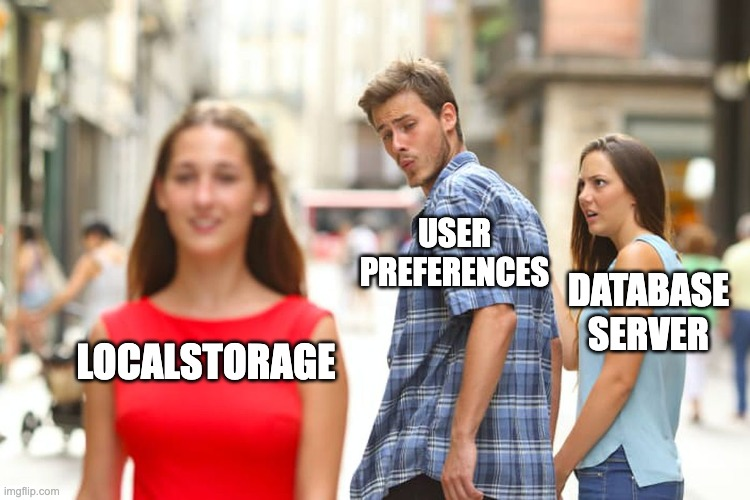

# Local Storage
## Saving data to user's device

---

# When to use local storage?

- No syncing with server needed:
    - Device / user preferences
    - Auth tokens storage
    - Tracking of actions



---

# Types of local storage

- Key-value (like Shared Preferences / User Defaults)
- Keychain / Keystore
- File System
- SQLite

---

# Key-value storage

- Like Shared Preferences / User Defaults: a key and a string
- In Expo: `expo-sqlite/kv-store` or `AsyncStorage`
- Not secure
- Not scalable

## Example: Simple Settings
```typescript
import Storage from 'expo-sqlite/kv-store';

// Store user theme preference
await Storage.setItem('theme', 'dark');
const theme = await Storage.getItem('theme');
```

---

# Keychain / Keystore

- Secure storage: Keychain on iOS, Keystore on Android
- In Expo: `expo-secure-store`
- Secure (encrypted)
- Only small values: tokens, passwords

## Example: Secure Token Storage
```typescript
// Store authentication token securely
await SecureStore.setItemAsync('authToken', 'jwt_token_here');
const token = await SecureStore.getItemAsync('authToken');
```

---

# File System

- File storage
- Built-in Android/iOS
- Not secure
- Not scalable

## Example: Cache Images
```typescript
import { File, Paths } from 'expo-file-system';

// Download an item sprite to the app's documents folder
const file = await File.downloadFileAsync(spriteUrl('potion'), Paths.document);
```

---

# SQLite

- Relational database
- Built-in Android/iOS
- Not encrypted
- Scalable

## Example: the bag
```typescript
await addToBag(potion)
const bag = await getBag()
const inBag = await isInBag(17)
```

---

# What to use to save the bag?

a) File System
b) Keychain
c) Key-value storage
d) SQLite

---

# What to use to save the bag?

a) File System
b) Keychain
c) Key-value storage 🤷
d) SQLite 👈


---

# `npx expo install expo-sqlite`

```typescript
// src/services/bag-db.ts
import * as SQLite from 'expo-sqlite'

const db = SQLite.openDatabaseSync('items.db')

db.execSync(`
  CREATE TABLE IF NOT EXISTS bag (
    id INTEGER PRIMARY KEY,
    name TEXT NOT NULL,
    sprite_url TEXT NOT NULL,
    created_at TEXT DEFAULT CURRENT_TIMESTAMP
  );
`)
```

Open once, create the table if it is not there. A module, not a class. Import the functions where you need them.

---

# Create, Read, Delete

```typescript
export async function addToBag(item: ItemListItem) {
  await db.runAsync('INSERT OR REPLACE INTO bag (id, name, sprite_url) VALUES (?, ?, ?)',
    [item.id, item.name, item.spriteUrl])
}

export async function getBag() {
  return db.getAllAsync<Row>('SELECT id, name, sprite_url FROM bag ORDER BY created_at DESC')
}

export async function isInBag(id: number) {
  const row = await db.getFirstAsync('SELECT id FROM bag WHERE id = ?', [id])
  return row !== null
}

export async function removeFromBag(id: number) {
  await db.runAsync('DELETE FROM bag WHERE id = ?', [id])
}
```

`?` placeholders, always. Never glue user input into SQL.

---

# SQLite + TanStack Query

```typescript
useQuery({ queryKey: ['bag'], queryFn: getBag })

useMutation({
  mutationFn: (item) => addToBag(item),
  onSuccess: () => queryClient.invalidateQueries({ queryKey: ['bag'] }),
})
```

- The database is a data source like PokeAPI. Same hook, same loading and error states.
- A **mutation** changes data and then **invalidates** the query. Every screen that shows the bag refreshes.
- **Native:** SQLite is a database file on the phone, read by a native module. The file lives in your app's sandbox and survives restarts.

---

# Next: exercise 3

The bag in SQLite. "Add to bag" on the detail screen, the Bag tab from the database, an empty state.

Kill the app. Open it. Still there.
