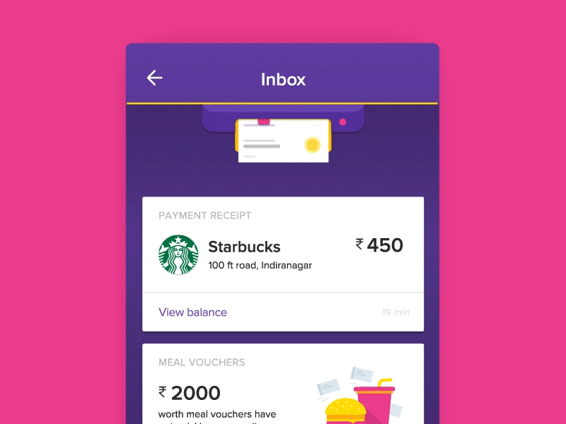
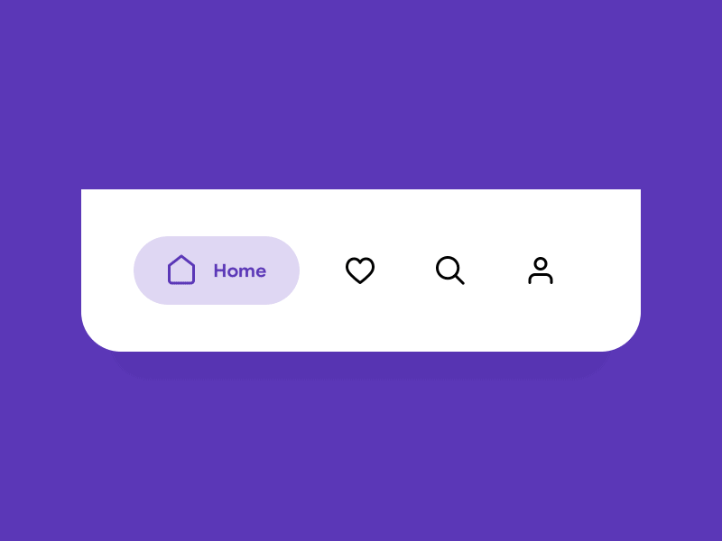
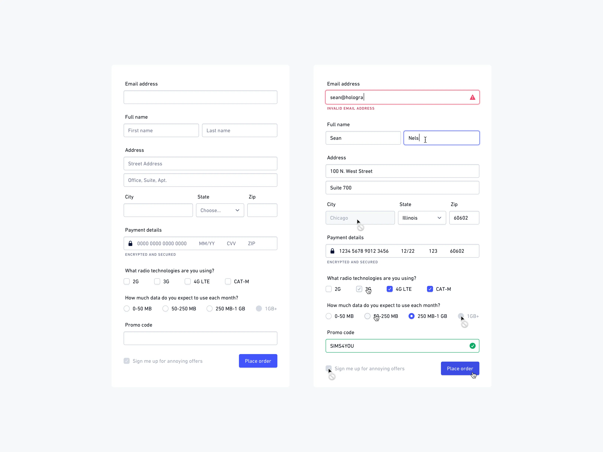
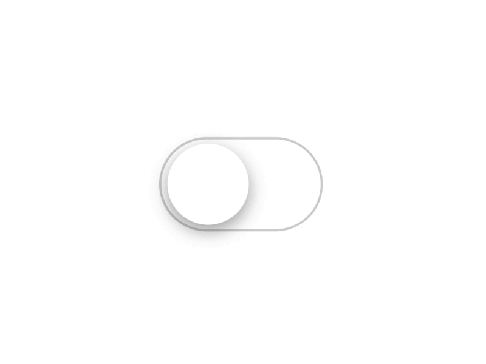
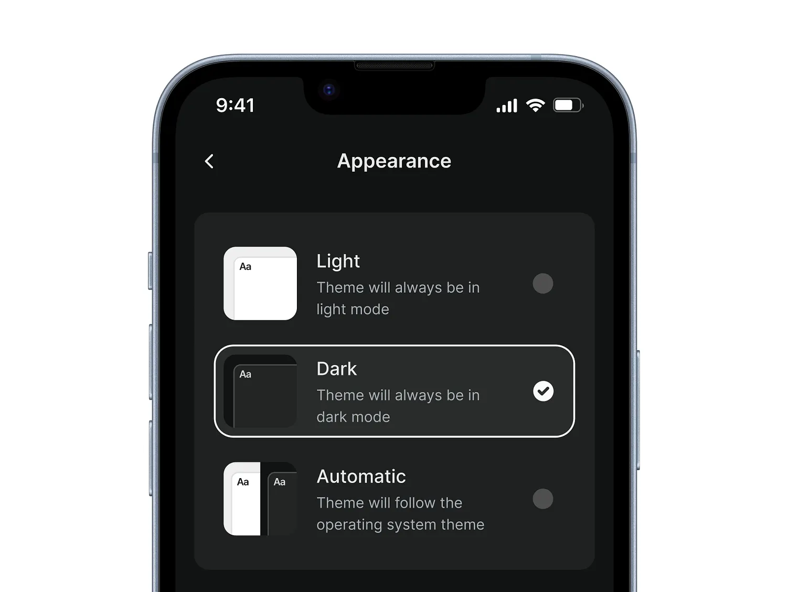

# State Management
## Five kinds of state, and where each one lives

---

# 1. Server State
## Data from APIs and External Sources

**Characteristics:** Asynchronous • Can be stale • Needs caching • Requires error handling



---

# 1. Server State - Example

```typescript
import { useQuery } from '@tanstack/react-query';

const UserList = () => {
  const { data: users, isPending, error } = useQuery({
    queryKey: ['users'],
    queryFn: () => fetch('https://example.com/api/users').then(res => res.json()),
    staleTime: 5 * 60 * 1000, // 5 minutes
  });

  if (users) {
    return (
      <View>
        {users.map(user => <Text key={user.id}>{user.name}</Text>)}
      </View>
    );
  }
  if (isPending) return <Text>Loading...</Text>;
  return <Text>Error: {error.message}</Text>;
};
```

---

# 2. URL State
## Navigation and Routing State



**Characteristics:** Every screen has a URL • Back stack keeps it

---

# 2. URL State - Example

```typescript
import { useLocalSearchParams, useRouter } from 'expo-router';

const UserProfile = () => {
  const { userId, tab } = useLocalSearchParams<{
    userId: string;
    tab: 'posts' | 'comments' | 'likes';
  }>();
  
  const router = useRouter();
  
  const navigateToUser = (newUserId: string) => {
    router.push(`/users/${newUserId}?tab=${tab}`);
  };
  
  const switchTab = (newTab: string) => {
    router.setParams({ tab: newTab });
  };

  return (
    <View>
      <Text>User ID: {userId}</Text>
      <Text>Active Tab: {tab}</Text>
      <Button title="Switch to Posts" onPress={() => switchTab('posts')} />
    </View>
  );
};
```

---

# 3. Form State
## User Input and Validation

**Characteristics:** User input focused • Validation required • Dirty/touched tracking • Submission handling



---

# 3. Form State - Example

```typescript
const [query, setQuery] = useState('');
const isValid = query.trim().length >= 2;

return (
  <View>
    <TextInput
      value={query}
      onChangeText={setQuery}
      placeholder="Search items..."
    />
    {!isValid && query.length > 0 && <Text>Type at least 2 characters</Text>}
  </View>
);
```

A search bar is form state. Bigger forms: `react-hook-form` works in React Native too.

---

# 4. Component State
## Local Component State



**Characteristics:** Component-scoped • UI-specific • Short-lived • Performance optimized

---

# 4. Component State - Example

```typescript
const [isToggled, setIsToggled] = useState(false);

const toggleToggled = () => setIsToggled(prev => !prev);

return (
  <View>
    <Button title="Toggle" onPress={toggleToggled} />
    {isToggled && <Text>Toggled</Text>}
  </View>
);
```

---

# 5. Global State
## Application-wide State



**Characteristics:** Shared across components • Long-lived • Centralized • Performance considerations

---

# 5. Global State
## Application-wide State

```typescript
const AppContext = createContext<{
  user: User | null;
  setUser: (user: User | null) => void;
  notifications: Notification[];
  addNotification: (notification: Notification) => void;
} | null>(null);

export const AppProvider = ({ children }: { children: ReactNode }) => {
  const [user, setUser] = useState<User | null>(null);
  const [notifications, setNotifications] = useState<Notification[]>([]);
  
  const addNotification = (notification: Notification) => {
    setNotifications(prev => [...prev, notification]);
  };

  return (
    <AppContext.Provider value={{ user, setUser, notifications, addNotification }}>
      {children}
    </AppContext.Provider>
  );
};
```

---

# Types of state in the item app

<style scoped>section { font-size: 26px; }</style>

| State | In our app | Where it lives |
|---|---|---|
| Server | The item list, one item | TanStack Query, from PokeAPI |
| URL | `/item/17` | Expo Router: `useLocalSearchParams` |
| Form | A search field, a form | `useState` in the screen |
| Component | A section that is open or closed | `useState` in the component |
| Global | Light or dark theme | The `ThemeProvider` from the template |

The bag is a special case: it is saved on the phone, but we read it the same way as server state. More on that after the break.
