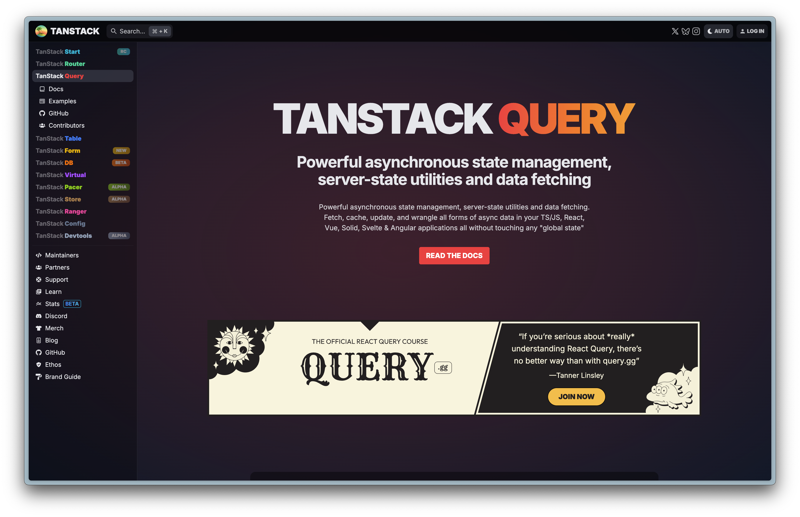
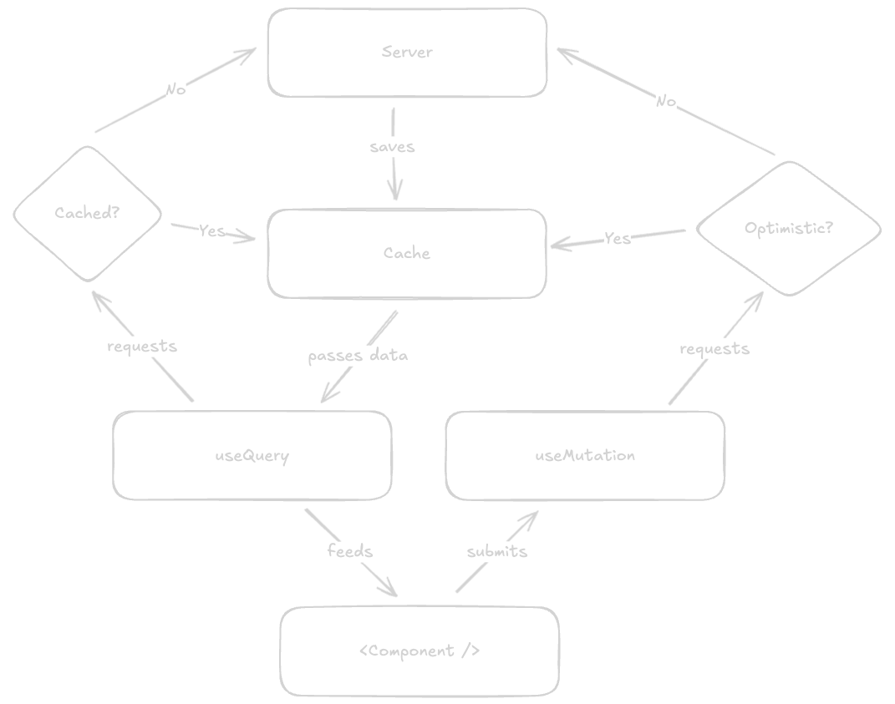
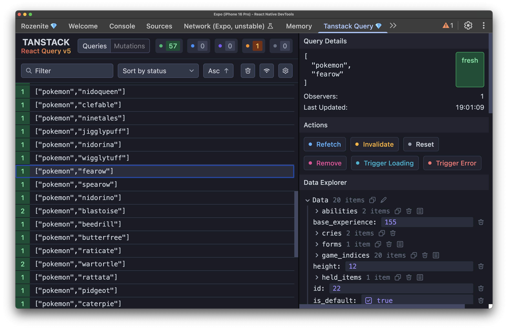
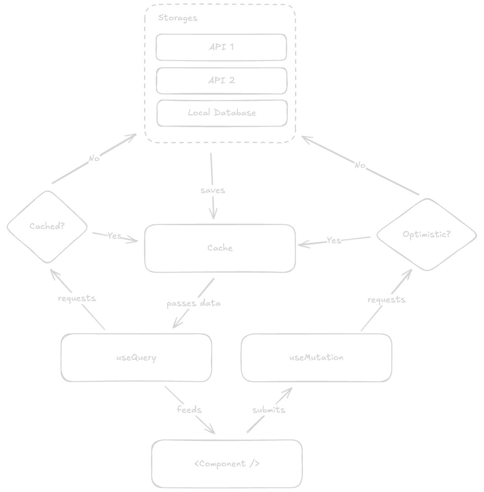

# Tanstack Query
## Getting the item data

---

# Tanstack Query
## What does it solve?

- Data fetching
- Caching
- Synchronization
- ... and more



---



---

# Traditional React Fetching

```jsx
function ItemList() {
  const [items, setItems] = useState([]);
  const [loading, setLoading] = useState(true);
  const [error, setError] = useState(null);

  useEffect(() => {
    const fetchItems = async () => {
      try {
        setLoading(true);
        const response = await fetch('https://pokeapi.co/api/v2/item?limit=60');
        const data = await response.json();
        setItems(data.results);
      } catch (err) {
        setError(err.message);
      } finally {
        setLoading(false);
      }
    };

    fetchItems();
  }, []);
}
```

---

# With TanStack Query

```jsx
import { useQuery } from '@tanstack/react-query';

function ItemList() {
  const { data: items, isPending, error } = useQuery({
    queryKey: ['item', 'list'], // cache identifier
    queryFn: () =>
      fetch('https://pokeapi.co/api/v2/item?limit=60')
        .then(res => res.json())
        .then(data => data.results)
  });
```

---

# Query keys

The key is the **address** in the cache.

```ts
useQuery({ queryKey: ['item', 'list'], queryFn: fetchItemList })
useQuery({ queryKey: ['item', 17], queryFn: () => fetchItem(17) })
```

- Same key: same data. Two screens with `['item', 17]` do one fetch.
- Other key: other data. Forget the `id` in the key and every detail shows the Potion.
- Keys match from the start: `invalidateQueries({ queryKey: ['item'] })` refreshes the list **and** every detail.

---



---

# Fresh and stale

<style scoped>section { font-size: 26px; }</style>

- **Fresh**: TanStack trusts the cache and does not fetch.
- **Stale**: TanStack shows the cache **and** fetches again in the background.
- `staleTime` sets how long data stays fresh. The default is `0`: stale right away.
- Stale data is fetched again when a new screen uses the key.
- A key that no screen uses is removed after 5 minutes (`gcTime`).

```ts
useQuery({ queryKey: ['item', 'list'], queryFn: fetchItemList, staleTime: 60 * 60 * 1000 })
```

An item does not change. An hour is fine.

---

# Without a network

Turn on airplane mode and open a screen.

- **In the cache?** You see the old data. The background fetch fails and sets `error` too. Check `data` before `error`, or an error screen hides the old list.
- **Not in the cache?** Spinner, then the error state.
- TanStack **retries 3 times** first. That is why the error takes a few seconds.
- A retry button calls `refetch()`.

Exercise 1: test this with airplane mode.

---

# isPending, isFetching, isLoading

<style scoped>section { font-size: 26px; }</style>

| Flag | True when |
|---|---|
| `isPending` | There is no `data` yet. |
| `isFetching` | A fetch runs now, also in the background with `data` on screen. |
| `isLoading` | `isPending` **and** `isFetching`: no data, and a fetch runs now. |

- Use `isPending` for the first spinner. `isLoading` is false when no fetch runs, for example when the query is off (`enabled: false`). Then you show nothing.
- Old tutorials and AI answers use `isLoading` as the name for "no data yet". In TanStack v4 it was. In v5 it is `isPending`.

---

# Handy

<style scoped>section { font-size: 26px; }</style>

**Pull to refresh.** `FlatList` has it built in. `isRefetching` is a fetch while there is already data.

```tsx
<FlatList refreshing={isRefetching} onRefresh={refetch} ... />
```

**Only fetch when you can.** No search term, no fetch. The query stays pending: show a hint, not a spinner.

```ts
useQuery({ queryKey: ['search', term], queryFn: () => search(term), enabled: term.length > 0 })
```

**Only take what you need.** `select` changes the data for this screen. The cache keeps all of it.

```ts
useQuery({ queryKey: ['item', 'list'], queryFn: fetchItemList, select: (items) => items.slice(0, 10) })
```

---

# What is a public API?

[pokeapi.co/api/v2/item/17](https://pokeapi.co/api/v2/item/17)

- A URL that returns **JSON**. Anyone can call it.
- **No login.** PokeAPI needs no key. Your own idea may use an API with a key or a login.
- Documented: you can read what comes back before you write code.
- Rate limits: be polite, cache. TanStack Query does that for you.

Your final assignment runs on one of these.

---

# Choosing an API for your own idea

<style scoped>section { font-size: 25px; } table { font-size: 0.8em; }</style>

Check before you commit to an idea:

| Question | Why |
|---|---|
| Key or login? | Fine, if I can run it. A key in your app is readable by anyone: in `.env`, never in the repo. Login is not taught. |
| Enough data for 3 to 6 features? | One endpoint with one list is too thin. |
| Stable and documented? | You have four weeks. Not the time for a moving target. |
| Returns JSON over HTTPS? | Anything else is extra work. |
| Free for this use? | Read the terms. |

Good ones: PokeAPI, Open-Meteo (weather), TheMealDB, Rijksmuseum, Open Library, SWAPI. There are lists: search "public APIs".

---

# Query anything

```jsx
useQuery({
  queryKey: ['item', itemId],
  // fetching something from the server
  queryFn: () => fetchItem(itemId),
});
useQuery({
  queryKey: ['bag'],
  // fetching something from local storage
  queryFn: () => getBag(),
});
```

---



---

# Next: exercise 1, then 2

**1. Live data with TanStack Query.** The item list from PokeAPI instead of the array. Loading and error visible.

**2. Detail page from PokeAPI.** Its own query per item, after the break.

`day-3/exercises/exercise-1-tanstack-query.md`
