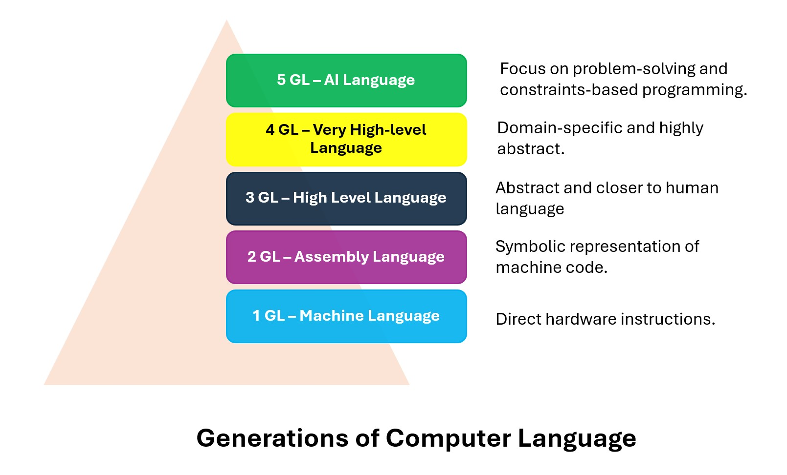
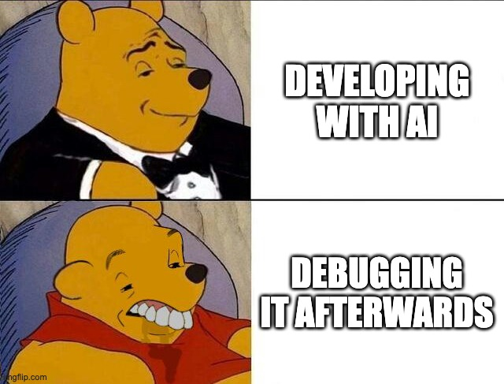

# Use of AI
## Disruptive or supporting?

---

# Poll
## How much are you using AI?

---

# Poll
## Which AI tools are you using?

---

# Poll
## Do you think AI will replace developers?

---

# Two ways to look at it

> ## _"AI is just another abstraction"_
Levi (and others), 2025

> ## _"A lot of knowledge, slightly less intelligence"_
Kevin, 2026

Both are true. They explain different things.

---

---

# Another abstraction

Assembly → C → JavaScript → React Native → an agent that writes it.

Every layer hides work. The layer underneath still exists, and it is still
your problem when it breaks.

> _How much implementation detail a programming language hides from developers, allowing focus on higher-level concepts_

[Measuring Abstraction Level of Programming Languages](https://github.com/const/const-articles/blob/main/evolution/2025/01-measuring-language-level/MeasuringAbstractionLevelOfLanguages.adoc)

---

# A lot of knowledge

The model has read more code than anyone in this room ever will.

Ask it about the Share API, `invalidateQueries`, the PokeAPI type endpoint,
the SQLite syntax. It knows. Instantly, and it is right.

That is knowledge. Knowledge is cheap now.

---

# Slightly less intelligence

Knowledge is not the same as intelligence.

It knows everything, and it does not quite get **your** situation.

That is why it writes a flawless API call and then makes a wrong assumption
about what you actually wanted.

---

# Exercise 4C, day 2

The bug: favoriting a Pokémon did not update the Favorites tab.

The agent knew exactly what `invalidateQueries` does. It could explain the
cache, the query keys, the whole model.

It did not know that **your** key said `favourites` in one file and
`favorites` in the other. So some of you got a `useFocusEffect` refetch:
the symptom gone, the typo still there.

Knowledge, no context. Your job is the context.

---

# So: three things stay yours

- **Steering.** Small tasks, real context, your choices.
- **Checking.** Read it, test it, push back.
- **Understanding.** Ask until you can explain it yourself.

That is also how this course grades you. Not by accident.

---

# Where it helps

- **Speed**: boilerplate, syntax you half remember, a whole screen in a minute.
- **Accessible**: you can start something you have never done before.
- **A patient teacher**: it will explain the same thing five times.

---

# Where it hurts

- **Confidently wrong**: not everything is in the training data, and it never says so.
- **Cognitive debt**: code in your repo that nobody in the room understands.
- **Debugging**: fixing a bug in code you did not write and did not read is the slowest work there is.

---

# Let's talk

No right answers here. What do you think, after four days?

- Is this still programming?
- What are you learning less of, and does that matter?
- Would you trust code you did not read, in production?
- What does a junior developer do in five years?
- Where do you draw your own line?

---

# The thesis of this course

> # _"The agent writes. You stay responsible."_

Everything in your repo is yours to explain and defend.
